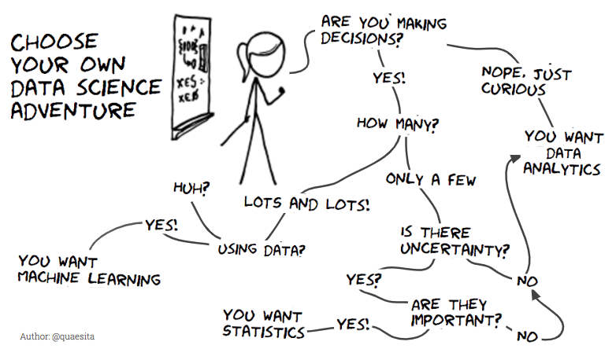

# Data In Argument & Decision Making

## Learning Objectives

* SWBAT explore data used in news and in rhetoric.
* SWBAT differentate between data and information.
* SWBAT recognize how data can be used to control human behavior.
* SWBAT differentiate kinds of data and different uses for data.

## Sequence

1. [Intro to Data Science](#intro-to-data-science)
2. [The Misuse of Data](#the-misuse-of-data)
3. [Data Literacy](#data-literacy)
4. [Close](#close)

## Intro to Data Science

### What is "Data Science"?

If you've been tuned into the news, the job market, or even just looking at ads on the subway recently, you've probably come across the term "data science". Colleges and universities are offering degrees in data science, businesses are using data science to out-perform each other, and even the government at all levels (borough, city, state, federal, international) is using data science to make data-driven decisions.

But what is "data science"?

**Data science** is an umbrella term that draws upon a number of fields including mathematics, statistics, computer science, and even sociology, journalism, and design. Depending on how the term is being used, it could mean anything from statistics to machine learning and artificial intelligence.

What distinguishes the different meanings of "data science" is really a question of what you're trying to do with data:

- Are you trying to better understand the data that you have? (That's **analytics**.)
- Are you trying to make decisions based upon the data you have? (That's probably **statistics**.)
- Do you have a lot of complex data and are trying to make sense of it? (That's **machine learning**.)

Data science as a field is put into practice depending on what you want to do with data:

- **Description**: You want to understand the data you have. _e.g. Subway trains arrive late to the station 24% of the time._
- **Prediction**: You want to guess what's going to happen in the future. _e.g. Next week, ridership will increase across the subway system by 9%._
- **Prescription**: You want to say what should be done as a result of your prediction about the future. _e.g. In order to meet the anticipated increase in demand, the MTA should add 3 trains per line per hour from 7am to 7pm._

### Optional Activity: Three Questions

Think about something you do most days. Maybe you ride the subway, maybe you go shopping, maybe you check social media, maybe you spend time with your family, maybe you go to the movies. See if you can come up with three questions you could investigate about that activity:

* The first question should be **descriptive** - the answer to this question should just describe the activity. _e.g. What percentage of my time do I spend playing video games every week?_
* The second question should be **predictive** - the answer to this question is related to some future state of the activity. _e.g. How much time can I expect to spend playing games next month?_
* The third question should be **prescriptive** - the answer to this question should recommend an action based on the answer to a prediction. _e.g. What other activities should I do instead of playing video games so often?_

#### Additional Reading

Explore these resources to see how journalists are talking about - and using - data.

- [WNYC Data News](https://www.wnyc.org/tags/data_news)
- [ProPublica](https://www.propublica.org/)

### Data vs. Information

When you've talked about data in the past, you may have used the words **data** and **information** interchangeably. Although they are quite similar, these two words have an important distinction:

- **Data** is comprised of the raw measurements, observations, or responses that would be collected from tools like feedback surveys, mechanical sensors, or even digital logs. Data can also be simple facts and figures that result from those raw measurements.
- **Information** is data that has been processed, interpreted, organized, structured or presented in a way that makes the data meaningful or useful. Information carries with it a point-of-view or an opinion because a human has made decisions about its meaning.

In addition to **data** and **information**, the term **insight** often accompanies a discussion about data. **Insight** is the understanding we get from data and information and usually relates to the decision-making capabilities that result from processing data into information.

#### Additional Reading

These readings introduce the concept of civic data, and how cities are collecting an increasing amount of data about residents, municipal activities (housing, crime, transportation, etc.), and more.

- ["The City of the Future Is a Data-Collection Machine" (The Atlantic, Nov 21, 2018)](https://www.theatlantic.com/technology/archive/2018/11/google-sidewalk-labs/575551/)
- ["On Being a Civic Data Scientist" (Medium, Aug 11, 2017)](https://towardsdatascience.com/on-being-a-civic-data-scientist-774c15232695)
- ["History of NYC's open data" (Data-Smart City Solutions, Mar. 8, 2017)](https://datasmart.ash.harvard.edu/news/article/new-york-city-open-data-a-brief-history-991)
- [How City Council uses open data to create legislation (YouTube)](https://www.youtube.com/watch?v=mrVevDEFan8&list=PLgCe1KzF20iwjeJDnI4l9OxDZKEsA6R6l&index=4) (video)

### Open Data

When you think about all of the data that exists in the world, you might start to realize that you cannot access most of it. In fact, businesses, governments, and even people keep a lot of the data they have private in order to secure a competitive advantage over other businesses, governments, and people. In the last decade, however, there has been a movement to make data more available instead of locking it down. This movement is called the Open Data Movement.

**Open data** is data that has been collected by businesses, governments or people that is shared freely on the Internet. This data could comprise anything: restaurant reviews, geolocation data, census data, 411 calls, property values, government budget data, etc. But why would governments be sharing data for anyone to take and use?

Increasingly, governments have recognized the fact that their authority and power is drawn from the people, and unlike businesses which might argue that exclusive access to their data would lead to increased profit, governments are arguing that opening access to their data is leading to increased civic engagement, improved public works, and additional accountability.

#### A Simple Case Study

Let's compare the MTA in New York City and a transit authority in some other city.

In the other city, the transit authority restricts access to their train arrival time data and budgets $20,000 to build an app for users to see when trains will arrive at the station. That transit authority doesn't know how to build apps; they know how to drive trains. So instead of only spending $20,000, their app goes over-budget by $15,000; it then underperforms with users, and the agency doesn't have any additional funds to spend to make it better.

In New York City, however, the transit authority recognizes that they're pretty good at driving trains, but not so great at making apps. The MTA instead spends $10,000 to build a system that shares train arrival data with developers. This open data is then taken by developers who compete for a $5,000 prize to whomever can build the best app with that data. The MTA receives more than 50 app submissions, and the public gets to choose which app is the best and should get the money. The developers of the winning app choose to build a business from their app, and they go on to develop apps for other cities as well. The MTA spent $15,000, didn't go over-budget, and got loads of great apps just by opening up their data and making it available for developers to use.

- Check out some of the real apps made by developers using the MTA's open data: [web.mta.info/apps/](http://web.mta.info/apps/)
- Explore the MTA's open data portal: [web.mta.info/developers/](http://web.mta.info/developers/)

#### Read more about open data in government

- [Open data in practice (NYC.gov video)](https://www.youtube.com/watch?v=l4undH4y0Ws)
- [Open Government Timeline](http://www.opengovtimeline.com/)
- ["What I learned in two years of moving government forms online" (Medium, Feb 22, 2018)](https://medium.com/@jgee/what-i-learned-in-two-years-of-moving-government-forms-online-1edc4c2aa089)

### Activity: What data do you encounter on a daily basis?

Take a moment to think through your daily routine, from when you wake up in the morning - maybe you eat breakfast, then you get dressed, commute to school, go to class, etc. - until you go to sleep at night. Think about each activity you do most every day, and make a list of your routine.

Now think about the data you encounter, interact with, and engage during each of those activities. Augment your list with the data you might see or create during each of those activities. It's ok if you just have a hunch that something might have data; go ahead and list it anyway. For example:

- There's nutritional data on the box of cereal I have for breakfast.
- I create data every time I swipe my MetroCard on the bus or train.
- Crosswalk signals are timed to be some duration; maybe they're based on data?

Share your list with a classmate to see what each other came up with. Add any additional data to your list if you hear something that you may have missed.

#### Additional Reading

- ["A Data Detox for a healthier, balanced digital life" (Mozilla: Internet Citizen, Nov. 8, 2017)](https://blog.mozilla.org/internetcitizen/2017/11/08/data-detox/)

## The Misuse of Data

Data does not exist in a neutral vacuum. Throughout history, data has been used both positively and negatively. At its worst, data has been a justification for discrimination ([GI Bill and black WWII veterans](https://www.history.com/news/gi-bill-black-wwii-veterans-benefits)), a means by which to forcibly separate people ([WWII internment of Japanese Americans](https://www.washingtonpost.com/news/retropolis/wp/2018/04/03/secret-use-of-census-info-helped-send-japanese-americans-to-internment-camps-in-wwii/?noredirect=on&utm_term=.f5e994f73a5d)), and a basis for all sorts of racist, sexist, xenophobic, and classist ills. Still today we see data being used to justify humanitarian crises around the world.

The [intentional disregard of data](https://www.washingtonpost.com/opinions/unauthorized-immigrants-are-overwhelmingly-law-abiding-but-it-wont-stop-trump/2019/06/02/5f4f696a-8193-11e9-bce7-40b4105f7ca0_story.html) poses a threat equal to the use of data for nefarious purposes, especially when that disregard is coupled with political or business interests. Perhaps the critical issue of our time where data has been misused by being _unused_ is climate change. Despite scientific consensus about the correlation between atmospheric carbon dioxide concentration and global temperature, politicians continue to ignore and deny the data, its interpretation, and its effects upon our planet.

#### How can data be misused?

Below are several ways data can be (or has been) misused. Can you think of any others?

- Data can be ignored. (see climate change example above)
- Data can be selectively filtered to support an argument. By not including all available data, a conclusion can be skewed in favor of a pre-determined outcome.
- Data can be used to round up, segregate, or otherwise disenfranchise a group of people. Census data is often cited as a means by which the government can assert control over specific sub-groups of the population.
- Data can be mis-interpreted. Too often the public lacks the skills to interpret data for themselves, so people accept the interpretation they are provided.
- Data can be used to violate privacy. Even though data providers claim data has been anonymized, sometimes there is still enough to find out exactly who someone is.

#### A Simple Case Study

Imagine a bank that is trying to decide whether or not to give someone a loan. In addition to deciding whether or not to grant a loan, the bank can also set the interest rate at which the customer should pay back the loan.

In order to make the loan application easier, the bank has made an app for smart phones through which the application is filled out. Once the app has been installed on a user's phone, the app also requests access to the user's music libraries (iTunes, Spotify, Pandora, etc.). The bank knows that most users will not read the fine print in the Terms & Conditions of their app, and since most users will just want to get a loan, they'll agree to whatever the bank wants them to.

**Can you think of ways data about a user's music listening might impact the decisions a bank would make about a loan?** Take a moment to brainstorm with a partner.

Do you think the bank could tell what sex, race, or class a user is just by the music they listen to? Maybe they would think the user is _probably_ Dominican if they listen to bachata; maybe they would think the user is _probably_ black if they listen to particular artists; maybe they would think the user is _probably_ wealthy if they listen to a lot of classical music. Accessing a user's music listening history might indicate information about the user that the bank couldn't otherwise ask in order to discriminate against loan applicants.

- What other data exists on your phone that might be misused to violate your privacy?

#### Additional information

These videos detail innovations in anti-discrimination technology:

- [Discrimination innovation 2018](https://www.youtube.com/watch?v=dSeCV5Tad7I&list=PLgCe1KzF20ix9S_6L41iCChJDv20MX4fu&index=16) (video)
- [Discrimination innovation 2017](https://www.youtube.com/watch?v=9U1Ka5DJXTU&list=PLgCe1KzF20ixjsDCjbyFMgdgwv_3yBHmf&index=17) (video)

### "Fake News"

The rise of partisan journalism has led to claims of "fake news" throughout the socio-political spectrum. "Fake news" has permeated elections, has destroyed careers, and is too-often used to deny any story someone disagrees with, whether the story is based in fact or not. But in reality, "fake news" is a symptom of the metrics by which **user engagement** is measured: clicks, views, and shares.

As information has become commoditized, the techniques used by content-providers, marketers, and media outlets have been co-opted to guide users to tantalizingly wrong information. The headline writing style made popular by websites like Upworthy - "You're not going to believe what happened next..." - which, once recognized as immensely effective at driving people to click and engage, was then used to sensationalize and polarize people's beliefs.

### Optional Activity: Identifying "Fake News"

How can you distinguish real news from "fake news"?

Take a few minutes to consider how you can tell whether a news story is real or "fake". Write down at least 5 questions you would use to interrogate any news story and how the answers to those questions might lead you to label the story as real or "fake".

Find a news article online from a satirical news outlet such as [The Onion](https://www.theonion.com/), [The Daily Mash](https://www.thedailymash.co.uk/), [The Borowitz Report](https://www.newyorker.com/humor/borowitz-report), [Private Eye](https://www.private-eye.co.uk/), or [ClickHole](https://www.clickhole.com/).

Use your 5 questions to decide whether the news story is real or "fake". How well did your questions do at identifying "fake news"?

#### Additional Reading

- ["The Misinformation Age" (PBS, Apr 22, 2019)](https://www.pbs.org/video/the-misinformation-age-0xqnez/)
- [PBS Newshour: Stories on "Misinformation"](https://www.pbs.org/newshour/search-results?q=misinformation)
- ["Who, what, when, where, why do hyperpartisan news sites exist?" (PBS Newshour)](https://www.pbs.org/newshour/extra/daily-videos/who-what-when-where-why-do-hyperpartisan-news-sites-exist/)
- [Lesson plan: How teens deal with the spread of misinformation](https://www.pbs.org/newshour/extra/lessons-plans/lesson-plan-student-reporting-labs-explores-how-youth-deal-with-misinformation/)
- [PBS Newshour: Tag: "Fake news"](https://www.pbs.org/newshour/extra/tag/fake-news/)

## Data Literacy

As you continue to grapple with distinguishing real news from "fake news", you'll realize that you're building an intuition for how to read and understand data. That data might be numerical, but it also might be textual, contextual, or even visual. The ability to digest and synthesize information is core to what is known as "data literacy". Data literacy also includes the ability to critique data and information as well as a visual acuity to interpret data-based graphics such as data visualizations.

- Why should data literacy matter to you?
- How will data literacy help you better judge arguments?
- Who do you think ought to be "data literate"? Why?
- How can data literacy help you protect yourself online?

#### Additional Reading

- [The Firefox Data Privacy Promise](https://blog.mozilla.org/firefox/firefox-data-privacy-promise/)

### Activity: Types of Data

See how many types of data you can brainstorm in 5 minutes. For each type, also consider potential sources of that data.

_For example, geographic data might come from satellites, from locations of users on their smartphones, or from city zoning data._

> Note: Think broadly! Try to consider various types of quantitative (numerical), qualitiative (textual), and alternative (images, video, sound, etc.) data. You might also think about less traditional sources of data like anecdotal data, case studies, and/or aggregate data.

## Close

We've seen a lot about how data is all around us and how that data can be used and misused. Next time we'll dig into how bias affects data science:

- decisions about what data we collect
- interpretation of data and information creation
- communication of analytical results
- possible actions to take resulting from analysis
