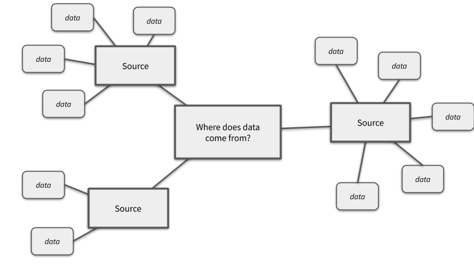
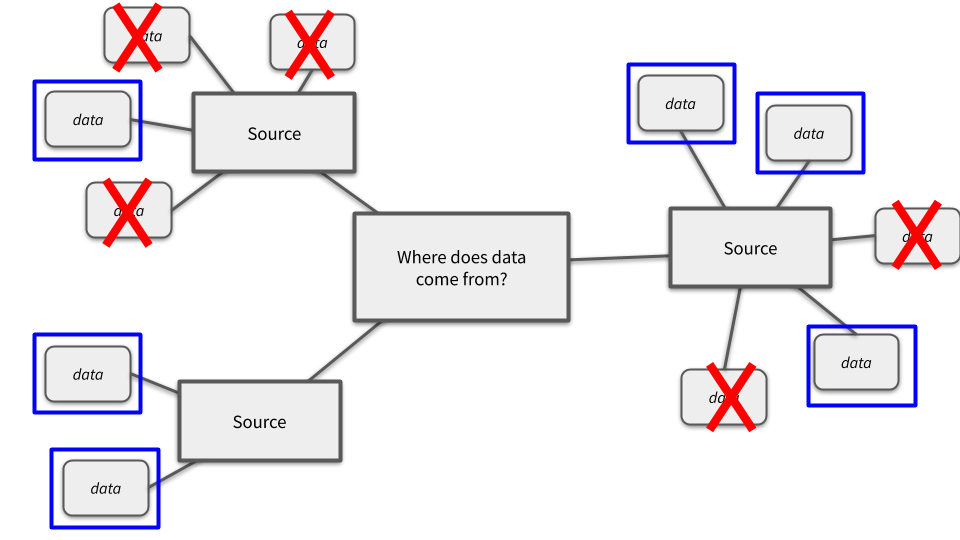
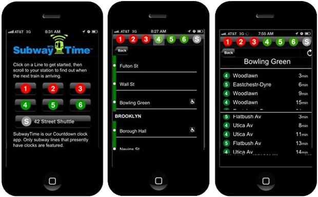

# Data Collection

## Learning Objectives

* SWBAT examine the ways that data collection can impact the story that data tells.
* SWBAT understand how sample size, sample technique, and sample demographics can affect data interpretation.

## Launch

What does data come from?

1. In teams of 3, make a mind map of as many sources of data as you can think of. For each source, branch off bubbles that list as many kinds of data in that source as you can think of.

> e.g. The MTA has data, including:
> - train arrival data,
> - bus arrival data,
> - passenger swipe data,
> - financial transaction data,
> - etc.

If you're struggling to come up with data sources, think about your daily routine:
- Where does data come from online?
- Where does data come from during your commute?
- Where does data come from at school?
- Where does data come from on tv?
- Where does data come from at the store?
- etc.

#### Additional Reading

- ["A Data Detox for a healthier, balanced digital life" (Mozilla: Internet Citizen, Nov. 8, 2017)](https://blog.mozilla.org/internetcitizen/2017/11/08/data-detox/)

## Open data vs. private data

Not all data can be seen by everyone. Many companies closely guard their data (and sometimes that data gets breached by hackers), but governments, some companies, and people online are starting to freely share their data; this is called **open data**. Open data increases the value of the data because people can use data in new and novel ways.

2. For each of the kinds of data you listed in bubbles on your mind map, put a box around the data that you think might be available as open data, and put an X over the data you think is private data.

Do you have more boxes or X's on your mind map? Why do you think that is? Is that a good thing?

#### A Simple Case Study

Let's compare the MTA in New York City and a transit authority in some other city.

In the other city, the transit authority restricts access to their train arrival time data and budgets $20,000 to build an app for users to see when trains will arrive at the station. That transit authority doesn't know how to build apps; they know how to drive trains. So instead of only spending $20,000, their app goes over-budget by $15,000; it then underperforms with users, and the agency doesn't have any additional funds to spend to make it better.

In New York City, however, the transit authority recognizes that they're pretty good at driving trains, but not so great at making apps. The MTA instead spends $10,000 to build an API that shares train arrival data with developers. This open data in the API is then taken by developers who compete for a $5,000 prize to whomever can build the best app with that data. The MTA receives more than 50 app submissions, and the public gets to choose which app is the best and should get the money. The developers of the winning app choose to build a business from their app, and they go on to develop apps for other cities as well. The MTA spent $15,000, didn't go over-budget, and got loads of great apps just by opening up their data and making it available for developers to use.

- Check out some of the real apps made by developers using the MTA's open data: [web.mta.info/apps/](http://web.mta.info/apps/)
- Explore the MTA's open data portal: [web.mta.info/developers/](http://web.mta.info/developers/)

#### Read more about open data in government

- [Open data in practice (NYC.gov video)](https://www.youtube.com/watch?v=l4undH4y0Ws)
- [Open Government Timeline](http://www.opengovtimeline.com/)
- ["What I learned in two years of moving government forms online" (Medium, Feb 22, 2018)](https://medium.com/@jgee/what-i-learned-in-two-years-of-moving-government-forms-online-1edc4c2aa089)

## Close

### Activities / datasets
- [YPAR](http://yparhub.berkeley.edu/) is a good resource and method
	- [Brainstorming Data Sources and Making a Data Collection Plan](http://yparhub.berkeley.edu/investigate/brainstorming-data-sources-and-making-a-data-collection-plan/)
	- [Internet Searches](http://yparhub.berkeley.edu/investigate/internet-searches/)
- Buzzfeed article on gentrification + 311 + noise complaints

## Sequence

1. [Some text](#some-text)

## Topic

Some text

## Topic

Some text

### Activity: Some text

Some text

### Some text

Some text

### Takeaways

* Topic - Some text
* Topic - Some text
* Topic - Some text
