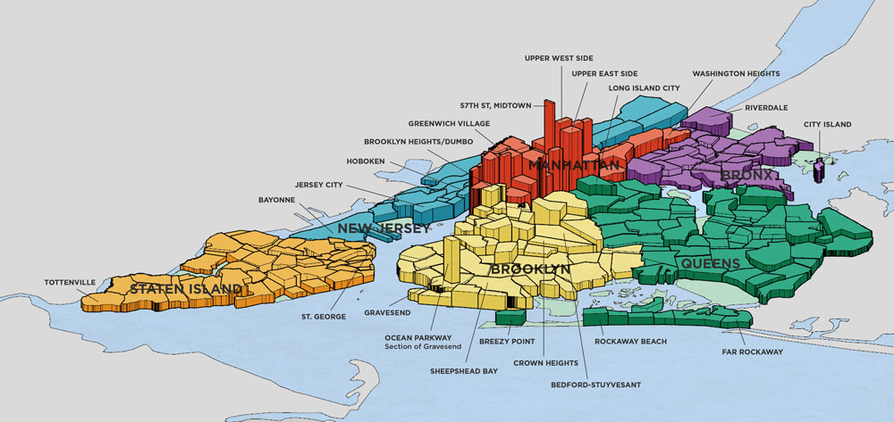
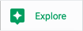
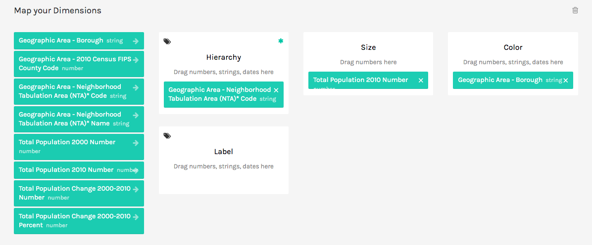
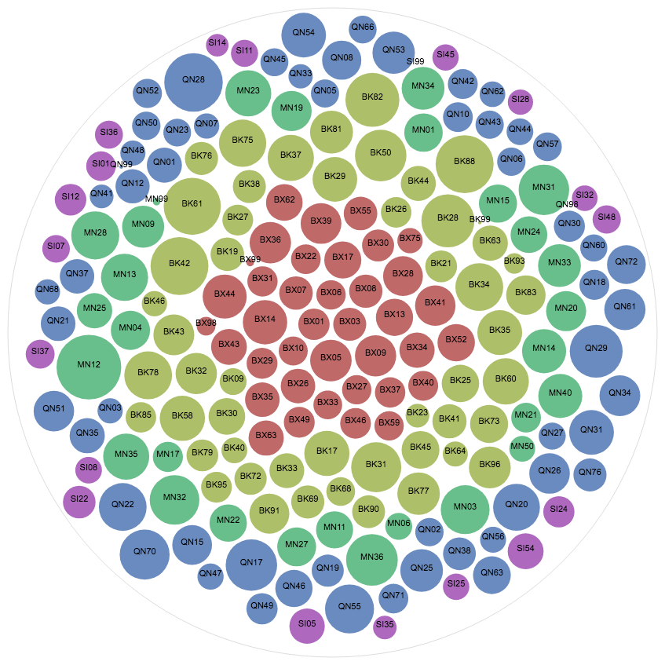
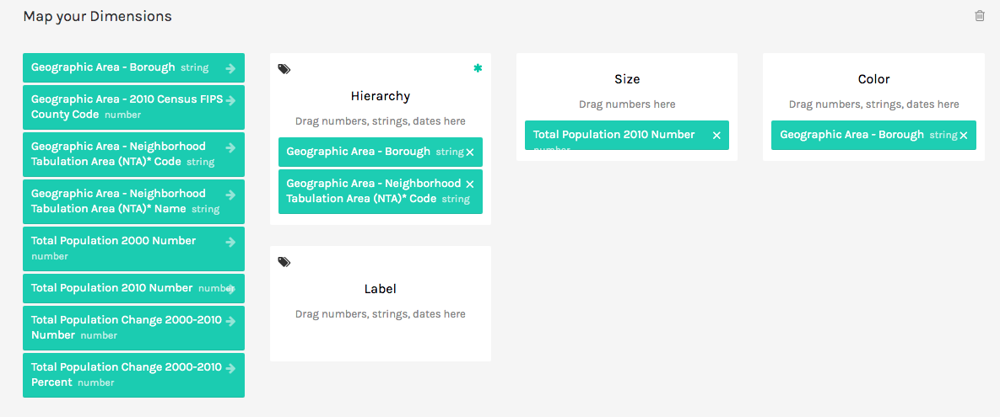
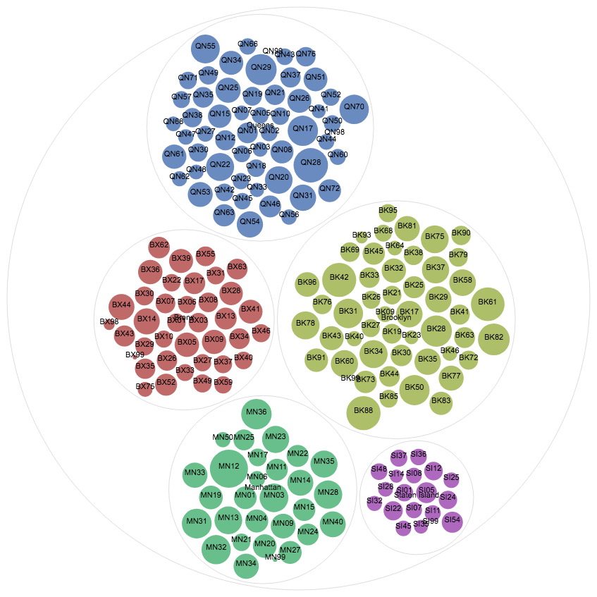
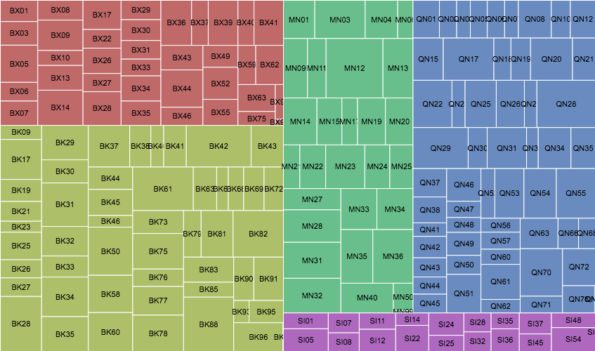
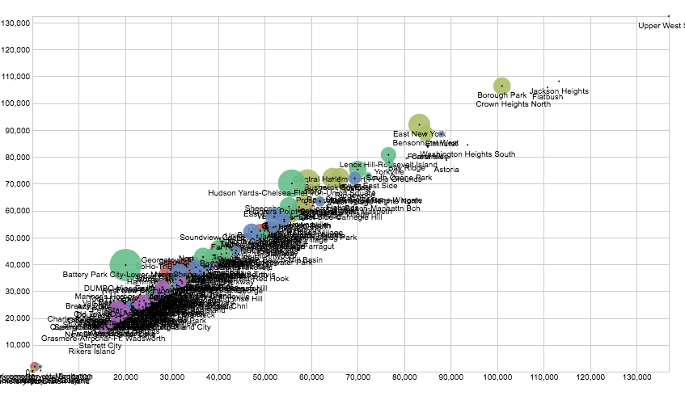

# NYC Census Data by Neighborhood


> 3D map of NYC property values by neighborhood from [neighborhoodx.com](https://neighborhoodx.com)

It's 20 minutes before a big meeting with City Hall, and your manager asks you to quickly make sense of the city's most recent census data. How can you quickly explore a dataset to get a sense of it?

## Google Sheets

- Make a copy of the [Census Demographics at the Neighborhood Tabulation Area (NTA) level](https://docs.google.com/spreadsheets/d/1VyYiY63blaLIyLAXIzk114vkCYPv0zMg8Lh33_2kldM/edit?usp=sharing)

> Note: this data is also available [from the NYC Open Data Portal](https://data.cityofnewyork.us/City-Government/Census-Demographics-at-the-Neighborhood-Tabulation/rnsn-acs2)

1. Scroll down through the dataset: what trends and patterns can you see? Does any data not belong?



2. Tap the "Explore" button in the bottom-right corner of Google Sheets. Then next to "Analysis", tap "More". Do any of the graphs have useful insights to share with your manager?
3. What do the peaks represent in the graph of "Total Population Change 2000-2010 Percent vs. Geographic Area - Neighborhood Tabulation Area"?
4. Explore the Chart feature of Google Sheets to try to generate a meaningful exploratory data visualization.

## app.rawgraphs.io

5. Export the Google Sheet as a CSV file (or download the raw data from [Open Data NYC](https://data.cityofnewyork.us/City-Government/Census-Demographics-at-the-Neighborhood-Tabulation/rnsn-acs2)). Then upload the file to [app.rawgraphs.io](http://app.rawgraphs.io/).
> Note: if you haven't already, delete the last two lines of commentary:
> ```
> "*Neighborhood Tabulation Areas, or NTAs, are aggregations of census tracts that are subsets of New York City's 55 Public Use Microdata Areas (PUMAs). ",,,,,,,
> "Primarily due to these constraints, NTA boundaries and their associated names may not definitively represent neighborhoods.",,,,,,,
> ```
6. Scroll down and choose the Circle Packing plot. Then scroll down and drag-and-drop the following fields in the following locations:
	1. Hierarchy: `Geographic Area - Neighborhood Tabulation Area (NTA)* Code`
	2. Size: `Total Population 2010 Number`
	3. Color: `Geographic Area - Borough`
	4. Label: 
	5. You can also choose "Sort By Size" to arrange all circles by size.


7. Drag-and-drop the `Geographic Area - Borough` tab as the first box under Hierarchy.


8. Choose a better label for each bubble, e.g. neighborhood name.
9. Using similar parameters, explore the Treemap visualization. Try to make something that looks like this:

10. Use the Sunburst chart to emphasize areas of the five boroughs where the population has grown significantly from 2000 to 2010. If you had more time, how might you clean the data to make the chart more visually appealing?
11. Use the Scatter Plot to emphasize neighborhoods where the population has grown significantly from 2000 to 2010. What outliers do you notice?

12. Explore the other visualization types to see if you can find any that give additional insight. Share what you create with your neighbor.
