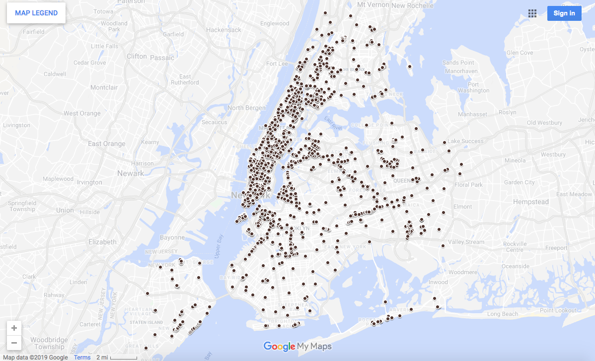
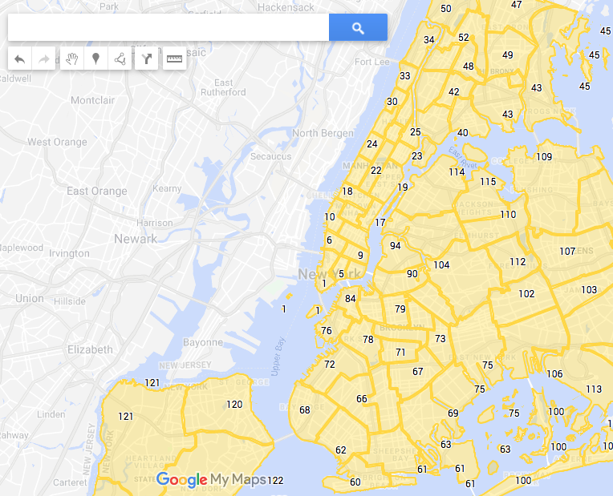
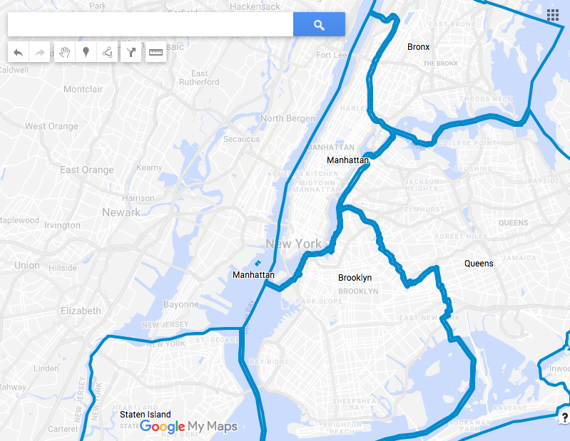
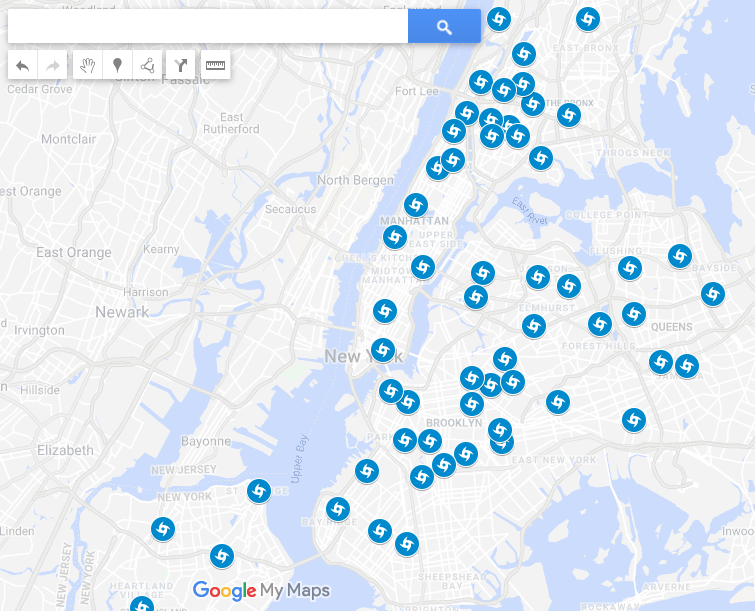

# Google Maps Lab

#### Where's Wi-Fi?

In this lab, we're going to use Google Maps to quickly build a data visualization showing where in NYC you can get free Wi-Fi!!

Let's start by exploring [New York City Datasets on data.gov](https://catalog.data.gov/organization/city-of-new-york). We want datasets that have geographic information, so let's filter by Format and choose `KML`.

In the resulting list, scroll down to the "NYC Wi-Fi Hotspot Locations" dataset. It's available in a couple of different formats; to start, download it as a CSV file and explore the data. What's there? What data might be useful for making a map?

Now let's go to Google Maps. Click the hamburger menu, choose "Your places", then choose "Maps", and "Create Map". Import the CSV file you downloaded by uploading it into Maps. Follow the prompts in order to build your map.

- See if you can figure out how to adjust the look of the map so each Wi-Fi hotspot is a small black circle instead of a blue pin.

## Make a new map using one or more of the following datasets

#### Police Precincts

> Tip: for this map, use the KML file

- Show the precinct number on each precinct outline
- Try modifying the styling

#### Borough Boundaries (with or without water)

 
> Tip: for this map, use the KML file

- Show the borough name on each borough

#### Hurricane Evacuation Centers

> Tip: for this map, use the KML file

- Make each icon a hurricane logo

## Explore!

Now you're on your own.

- Find any other dataset and map it.
- See if you can find additional datasets to add to - and enrich - your map!