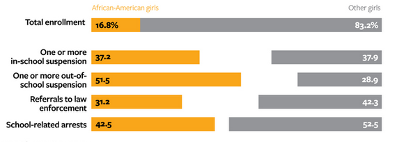

# Excerpt 

## The Economic Impact of School Suspensions (in [The Atlantic](https://www.theatlantic.com/business/archive/2014/10/the-economic-impact-of-school-suspensions/381859/))

#### A recent report found that African-American girls were suspended at much higher rates than their white peers, a phenomenon that leads to lower earnings and educational attainment in the long run.

Tiambrya Jenkins was just 14 years old when she got into a fistfight that would change the course of her educational trajectory. Following an after-school scuffle between Jenkins and a white classmate, the two girls — both freshmen at Rome High School in Georgia — were transferred to an alternative school as punishment. Her white classmate was allowed to return to their original school after 90 days. But Jenkins spent the rest of the year at the transitional academy, a place she describes as more like prison than school. "It was really, really boring. You just sat there all day until the bell rang," she says. "They didn't teach us anything."

At the academy, minor missteps such as talking out of turn or violating the dress code were used as reasons to delay a student's return to high school, Jenkins says. Simple organizational mistakes like showing up late or forgetting class materials were seen as acts of defiance and could turn the clock back to zero on a student's 90 days at the transitional academy. After forgetting her notebook one day and suffering the consequences, Jenkins began stashing spares in an abandoned house across the street from the school, "just in case."

Two years later, Jenkins is back at her old high school, but she still feels hopelessly behind. Once a top math student, she'll be lucky to achieve a passing mark in advanced algebra this year. "I don't even know what we're learning," Jenkins says. "The teacher, she'll be teaching something, and I don't even know what it is. I just see a bunch of numbers on the board."

#### Share of Disciplined Female Students, by Race

Jenkins is not alone in her experience. A recent report finds African-American girls were suspended at six times the rate of white girls, and more than any other group of girls (and several groups of boys). This is despite evidence that African-American students do not misbehave more frequently than their peers. The study, released in September by the NAACP Legal Defense and Educational Fund and the National Women's Law Center, outlines the barriers to African-American girls staying in school and shows how poor educational outcomes can limit their opportunities, from lower graduation rates to setbacks in expected lifetime earnings.

...

Education levels have an extraordinary impact on future wages, with academic attainment standing in as a rough proxy for future wealth. A female African-American college graduate typically sees an increase of about $657,000 over the course of her lifetime as compared to a female African-American high school graduate, according to the report. Should she fail to graduate from high school, her financial outlook worsens considerably. In 2013, 43 percent of African American women without a high school diploma were living in poverty, compared to 29 percent with a high school diploma and just 9 percent with a bachelor's degree, U.S. Census data show. Helping African-American girls successfully complete high school, then, could stave off a lifetime of poverty for them and their families.

...

The reasons for such setbacks have less to do with student behavior, the report's authors argue, than with disproportionate and overly punitive disciplinary practices that remove African-Americans from classes for minor and subjective infractions (examples include violations of dress code or even wearing natural hairstyles). "Traditional" middle-class notions of femininity, which value passivity in girls, can clash with stereotypical images of African-American females as loud, assertive, and provocative, and generate differing punishments for similar conduct, the authors note. Subjective offenses like "disobedience" or "disruptive behavior" may signify little more than a student's failure to conform to dominant gender norms or fit a teacher's view of what constitutes appropriate "feminine" behavior.

...

"My whole life has been affected by a fight that I was in when I was 14," she says. "It's not something that you can take back and not something that was premeditated, and I still have to deal with the consequences every day."