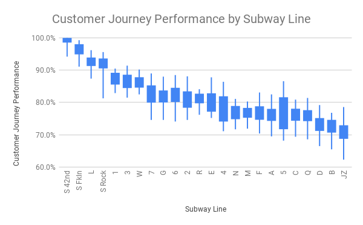

# Statistics

## Learning Objectives

* SWBAT use statistical measurements (mean, median, mode, variance, quartiles) to interpret data.

## Sequence

1. [Intro](#intro)
2. [Mean, Median, Mode, Range](#mean-median-mode-range)
3. [Variance](#variance)
4. [Quartiles](#quartiles)
5. [Other Statistical Descriptions](#other-statistical-descriptions)
6. [Close](#close)

## Launch

Make a copy of the [NYC Subway Customer Journey Time Performance](https://docs.google.com/spreadsheets/d/1uSd7IMLpnMWYM0zrJJZLdXc_yVAD-dK62XRNRLl7U0Y/edit?usp=sharing) Google Sheet (Source: [dashboard.mta.info](http://dashboard.mta.info/))

> Note: This data considers end-to-end trips and any delays caused by the MTA. The data represents the percent of successful trips each month; a successful trip is defined as a traveler who arrives within 5 minutes of the expected trip duration (according to the MTA).

Explore the raw data in the "Customer Journey Time Performan" sheet. Answer as many of the following questions as you can based on the raw data:
- Which line has the best performance during peak times?
- Which line has the worst performance during peak times?
- Which line has had the broadest range of performance during peak times?
- Which line has had the narrowest range of performance during peak times?
- Which non-shuttle line, on average, is the best during peak times?
- Across all lines, how often does a rider get to their destination within 5 minutes of their anticipated travel time during peak times?
- For the 6, how often does a rider get to their destination within 5 minutes of their anticipated travel time during peak times?

Did you find it difficult/frustrating/impossible to answer any of those questions? It's ok if you did. We're going to aggregate and manipulate the data so that we can begin to answer all of those questions.

## Mean, Median, Mode, and Range

You probably have already learned about mean (the average), median (the middle number), mode (the number occurring most often), and range (the max minus the min) in math class, so we won't cover those here. Instead, we're going to use those statistical measurements in Google Sheets to get a sense of our data.

First of all, when you have a set of data, you can quickly calculate each measurement in Google Sheets using a formula:

#### Mean
```
=AVERAGE(A:A) # calculates the mean of everything in column A
=AVERAGE(B2:B5) # calculates the mean of the values in the cells B2, B3, B4, B5
```

#### Median
```
=MEDIAN(A:A) # calculates the median of everything in column A
=MEDIAN(B2:B5) # calculates the median of the values in the cells B2, B3, B4, B5
```

#### Mode
```
=MODE(A:A) # calculates the mode of everything in column A
=MODE(B2:B5) # calculates the mode of the values in the cells B2, B3, B4, B5
```

#### Range
```
=MAX(A:A)-MIN(A:A) # calculates the range of everything in column A
=MAX(B2:B5)-MIN(B2:B5) # calculates the range of the values in the cells B2, B3, B4, B5
```

## Distributions

Can you guess how many trips there are every year on the NYC subway? [According to the MTA](http://web.mta.info/nyct/facts/ridership/), there were 1,680,060,402 rides in 2018 - which was actually down from a peak in 2015 of 1,762,565,419 rides. That's a lot of swipes!

Data scientists use different mathematical tools to make sense of data when there are so many data points to crunch because it's not just the average or middle value that matters, but instead how all of the values are distributed; are there more high numbers? more low numbers? an even amount of each? And with so much data, there are usually a lot of different ways you can cut it: by line, by borough, by stop, by time of day, etc.

## Quartiles

One way to get a sense of a distriubtion is by using **quartiles**. Quartiles are a way to dissect a distribution by splitting the data into four chunks where each chunk of the dataset has the same number of values within it.

How can you do that? We already know how to split a dataset into two equal chunks: that's the median. So to split a dataset into quartiles, you first find the median of a dataset, and then you find the median of each half. Doing this defines the boundaries of each quartile:

- The first quarter ranges from the minimum value in the dataset up to the median of the first half of the dataset (the first quartile).
- The second quarter ranges from the median of the first half of the dataset (the first quartile) up to the median of the whole dataset (the middle quartile).
- The third quarter ranges from the median of the whole dataset (the middle quartile) up to the median of the second half of the dataset (the third quartile).
- The fourth quarter ranges from the median of the second half (the third quartile) of the dataset up to the maximum value in the dataset.

### Activity: Dividing into Quartiles

Consider the following dataset of customer journey time performance for the A train, which only got the necessary sensors installed in March 2017:

```csv
month, period, customer journey time performance
2017-03, peak, 75.00%
2017-03, offpeak, 72.60%
2017-04, offpeak, 72.90%
2017-04, peak, 76.90%
2017-05, peak, 73.00%
2017-05, offpeak, 69.90%
2017-06, peak, 70.60%
2017-06, offpeak, 66.40%
2017-07, offpeak, 71.00%
2017-07, peak, 76.80%
2017-08, offpeak, 72.30%
2017-08, peak, 77.20%
2017-09, offpeak, 71.60%
2017-09, peak, 77.10%
2017-10, peak, 73.70%
2017-10, offpeak, 69.70%
2017-11, offpeak, 67.50%
2017-11, peak, 71.80%
2017-12, peak, 71.90%
2017-12, offpeak, 68.20%
2018-01, peak, 69.50%
2018-01, offpeak, 60.90%
2018-02, peak, 74.60%
2018-02, offpeak, 65.50%
2018-03, peak, 76.30%
2018-03, offpeak, 68.90%
2018-04, peak, 74.10%
2018-04, offpeak, 70.50%
2018-05, offpeak, 69.20%
2018-05, peak, 75.90%
2018-06, peak, 78.70%
2018-06, offpeak, 71.50%
2018-07, offpeak, 70.90%
2018-07, peak, 78.00%
2018-08, offpeak, 70.90%
2018-08, peak, 77.90%
2018-09, peak, 77.80%
2018-09, offpeak, 72.00%
2018-10, offpeak, 71.80%
2018-10, peak, 77.20%
2018-11, peak, 75.00%
2018-11, offpeak, 71.50%
2018-12, offpeak, 73.10%
2018-12, peak, 76.20%
2019-01, offpeak, 75.10%
2019-01, peak, 76.90%
2019-02, offpeak, 74.40%
2019-02, peak, 76.90%
2019-03, peak, 78.30%
2019-03, offpeak, 75.40%
2019-04, offpeak, 77.10%
2019-04, peak, 81.30%
2019-05, peak, 82.50%
2019-05, offpeak, 76.70%
2019-06, offpeak, 77.40%
2019-06, peak, 82.00%
```

1. Calculate the quartiles for all A train data.
2. Calculate the quartiles for the peak A train data and the quartiles for the off-peak A train data.
3. What difference(s) do you see between the peak and off-peak data?

> Note: you can copy and paste this data into a new Google Sheet and "Data > Split text to columns" in order to help sort it.

### Activity: Interpreting Quartiles


> NYC MTA Peak Customer Journey Time Performance by Subway Line

The graph above is a "Candlestick Plot" (or Box Plot, or Box-and-Whiskers Plot) for the dataset we've been exploring, which shows the distributions for all of the various lines in the dataset. The bottom and top of each box represent the 1st and 3rd quartiles, respectively, and the ends of the whiskers represent the maximum and minimum values. Unfortuately Google Sheets doesn't also show the median value, however most Box Plots do.

> Note: If you'd like to see/show how the data was manipulated in Google Sheets to produce the Candlestick Plot, it's available [here](https://docs.google.com/spreadsheets/d/1uSd7IMLpnMWYM0zrJJZLdXc_yVAD-dK62XRNRLl7U0Y/edit?usp=sharing).

Let's revisit the questions we asked before and see whether we can now answer any of them:
- Which line has the best performance during peak times?
- Which line has the worst performance during peak times?
- Which line has had the broadest range of performance during peak times?
- Which line has had the narrowest range of performance during peak times?
- Which non-shuttle line, on average, is the best during peak times?
- Across all lines, how often does a rider get to their destination within 5 minutes of their anticipated travel time during peak times?
- For the 6, how often does a rider get to their destination within 5 minutes of their anticipated travel time during peak times?

#### Optional Extension

If there's extra time, feel free to modify the ["Journey Time Summary Statistics" sheet](https://docs.google.com/spreadsheets/d/1uSd7IMLpnMWYM0zrJJZLdXc_yVAD-dK62XRNRLl7U0Y/edit?usp=sharing) in order to make the same graph for the "off peak" data. To do so, click on Column C or D, then click on the existing filter of the Pivot Table (you'll learn more about these in a future class). Uncheck "peak", and check "offpeak", tap "OK", and the data should update.

Click over to the "Quartiles Chart" to see the updated graph.

- How do the "off-peak" distributions compare to the "peak" distributions?

#### Additional Reading

- This lecture was inspired by [Todd W. Schneider's analysis of subway countdown clock data](https://toddwschneider.com/posts/nyc-subway-data-analysis/)
- [How 2 MTA Decisions pushed the subway to crisis (NY Times, May 5, 2018)](https://www.nytimes.com/interactive/2018/05/09/nyregion/subway-crisis-mta-decisions-signals-rules.html) - NY Times
- [How your commute has changed: NYC subway variability calculator (NY Times, July 8, 2019)](https://www.nytimes.com/interactive/2019/07/08/upshot/nyc-subway-variability-calculator.html?mtrref=www.google.com)

## Close

The dataset we explored didn't just have customer journey time performance; it also included the number of passengers who rode on each line during each month.

Come up with 5 questions you could ask about the number of passengers who rode on each line during each month that make use of statistical measurements.
