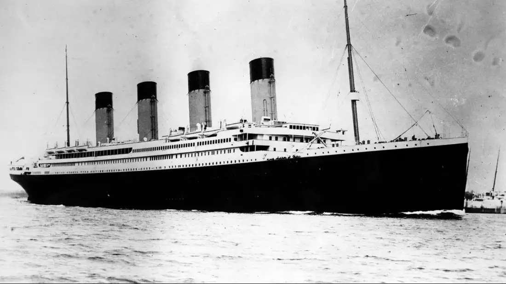

# Titanic Lab

In this lab, you'll explore historical data about passengers on the _RMS Titanic_. Your goal is to determine the factor(s) that led to passengers' survival (or death).

- Make a copy of the [Titanic Data Google Sheet](https://docs.google.com/spreadsheets/d/17PncyppLXjKyGZFgcSfgkWIulJ-rsZv2suqQ_bsSKE4/edit?usp=sharing)

> The file contains a `README` sheet with definitions for the variables. Consult this file for abbreviations (e.g. C, Q, S) and Booleans (survival: 0 = No, 1 = Yes).

1. Using the Filter view of the data, who were the oldest and youngest recorded passengers on the _Titanic_? What was the cost of each of their tickets? and from which port did they leave?
2. Using the Filter view of the data, list the members of the biggest family on the voyage. (Hint: use the `SibSp` and `ParCh` counts.)
3. In what cabin(s) did the passengers stay who had paid the highest fare? How much did they pay? and from which port did they leave?
4. Use a Pivot Table to count how many passengers survived vs. died on the _Titanic_. Is there anything surprising about the result?
5. Use a Pivot Table to count how many passengers left from each of the ports of embarkation. Where did the majority of passengers get onto the _Titanic_?
6. Use a Pivot Table to count how many passengers from each port of embarkation survived vs. died. Describe any pattern(s) you see in the result.
7. Modify your Pivot Table to count how many passengers from each class survived vs. died. How does this result confirm or contradict your intuition?
8.  What was the average age for a _Titanic_ survivor as compared to a _Titanic_ victim? The maximum ages? The minimum ages? What do those results indicate? 
9. What was the average fare for a _Titanic_ survivor as compared to a _Titanic_ victim? What does the result indicate?
10. Based on the data, what factors had the greatest impact on whether or not a passenger survived the _Titanic_? Which factors correlate with others vs. which factors are independent?
