# Data Visualization

## Learning Objectives

* SWBAT consider how and when data visualization can (and must) be used to help communicate information more intelligibly.
* SWBAT differentiate between ethical, unintentionally misleading, and intentionally misleading data visualizations.

## Launch

Let's all copy this spreadsheet: [https://docs.google.com/spreadsheets/d/1oIMO0LyJLDOKUmzJl_f_g-ggm-PlijnvoLyubye_mvY/edit?usp=sharing](https://docs.google.com/spreadsheets/d/1oIMO0LyJLDOKUmzJl_f_g-ggm-PlijnvoLyubye_mvY/edit?usp=sharing)

1. Describe any similarities or differences you observe between the four datasets.
2. Based on your observations, predict which dataset will have the largest mean value of x and which will have the largest mean value of y.
3. Based on your observations, predict which dataset will have the largest median value of x and which will have the largest median value of y.
4. For each dataset, calculate the mean of x and the mean of y. Compare your answer to your prediction.
5. For each dataset, calculate the median of x and the median of y. Compare your answer to your prediction.
6. Calculate the equation for the linear regression (line of best fit) for each dataset. What do you notice?
> Note: You can use the `=SLOPE(data_y, data_x)` function and the `=INTERCEPT(data_y, data_x)` function to quickly calculate the SLOPE and INTERCEPT for each dataset.
7. Taking into account your predictions and your calculations, how might you compare the datasets to one another?
8. Graph each dataset using a Scatter Plot in Google Sheets. How do the four datasets differ?

### Visualization

Visualization is an umbrella term that emcompasses any technique of making data visually accessible, including the graphs and charts you're used to seeing, along with maps, interactive tools, dashboards, and more. Data visualization is used everywhere from scientific reports to the news, from government analyses to [the grocery store](https://www.fastcompany.com/90347782/the-humble-receipt-gets-a-brilliant-redesign):

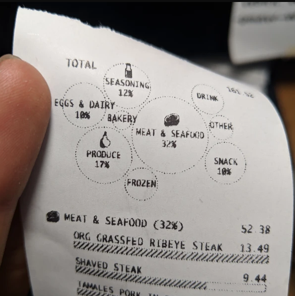
> Susie Lu: Redesigned Receipt

The best data visualizations take in new data as it's generated and present a visual for someone to use to make a decision, like a [live-updating subway map that shows where congestion or delays are](http://brunoimbrizi.com/experiments/#07):

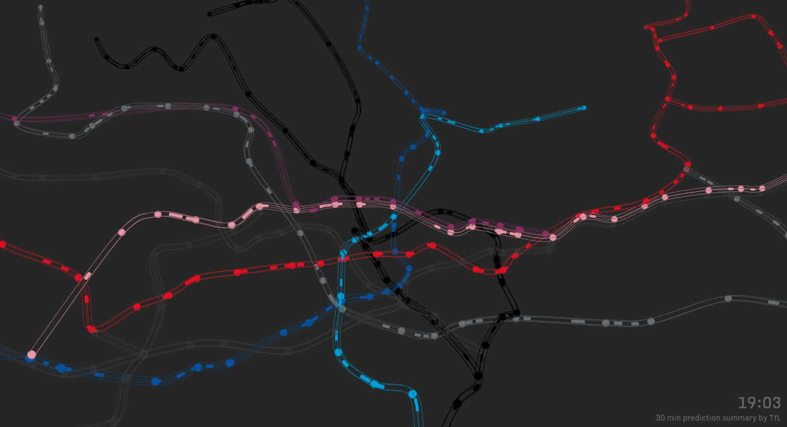
> Bruno Imbrizi: TfL Live Tube Train Positions

Or even a map that helped determine the source of a cholera outbreak. Can you find the epicenter of the outbreak?

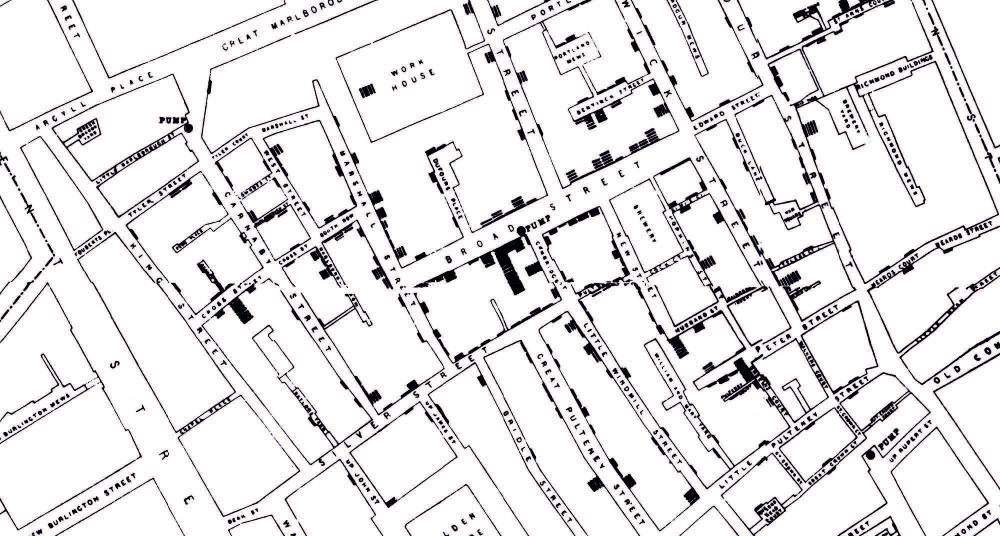
> John Snow: Map of Cholera Outbreak (1854) 

### Bad visualizations

The [worst visualizations](https://simplystatistics.org/2012/11/26/the-statisticians-at-fox-news-use-classic-and-novel-graphical-techniques-to-lead-with-data/) intentionally mislead the viewer to a conclusion that the data does not support. You might encounter these visualizations when the y-axis is truncated or when percentages don't add up to 100%:

|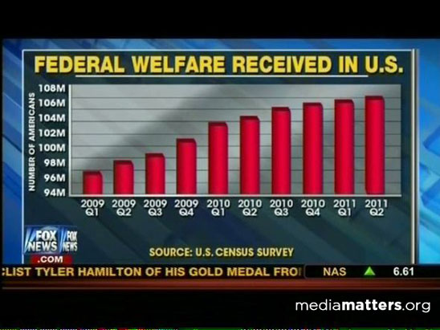||
| :---: | :---: |
| Truncated y-axis | Pie chart > 100% |

## Interpreting Data Visualizations

The bad visualizations above work because our brains are sometimes too quick to jump to a conclusion; sometimes we don't pause to think about what the shapes on a visualization mean or how they might skew our perception before we settle upon the meaning of the visualization. Just like how you need to be literate when reading prose, **visual literacy** is the skill that enables us to read data visualizations.

### Questions to Ask When Reading a Visualization

- What does the visualization measure?
- If there are labeled axes, what do they say?
- What do the numbers represent?
- Which value is the highest? The lowest?
- Did the author use the right chart or graph to tell their story?
- What is the overall message of the chart or graph?
- Can you explain this chart or graph to others?

### Questions to Ask When Evaluating a Visualization

- Do you see any trends or patterns?
- How are the different elements of the visualization related?
- What is the main message of the visualization?
- How do the words, phrases, and visualizations work together to get the point across?
- Does the visualization do a good job of telling its story?
- Why do you think the author chose a visualization to convey their message?
- Do you feel like you can explain this visualization to others?

To practice your visual literacy, choose one of the visualizations below from W.E.B. Du Bois's "Modernist Data Visualizations of Black Life" (1900), and do your best to answer the questions above:

| | | |
| :---: | :---: | :---: |
|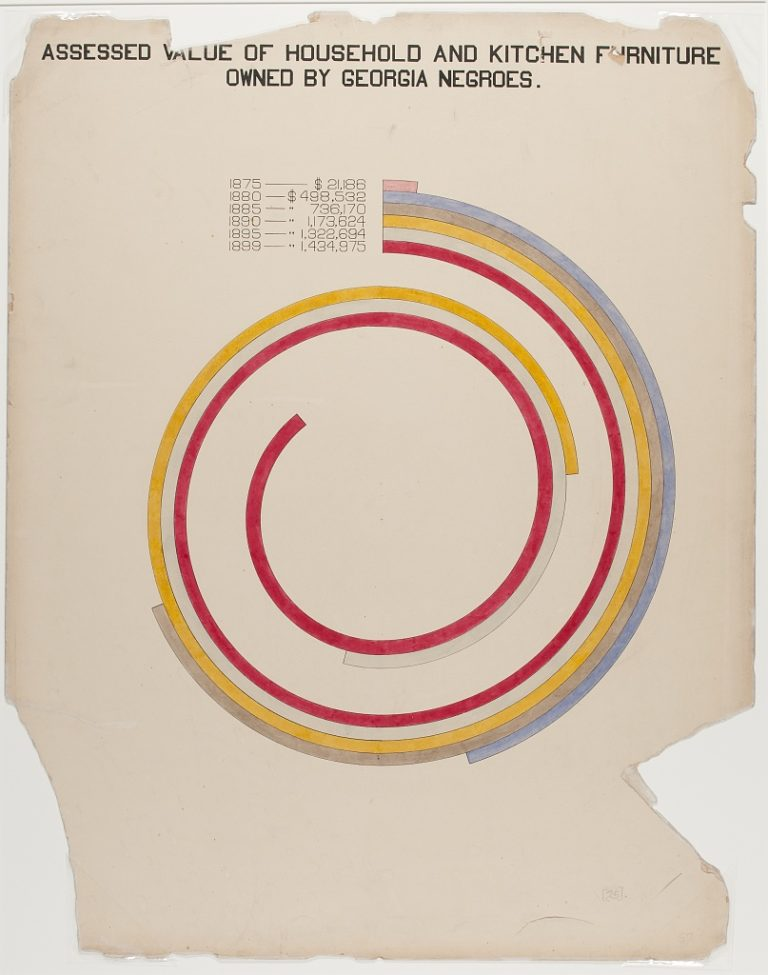|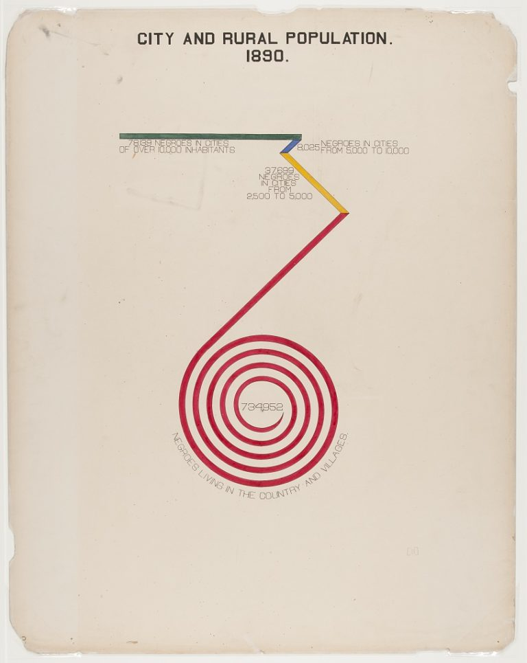|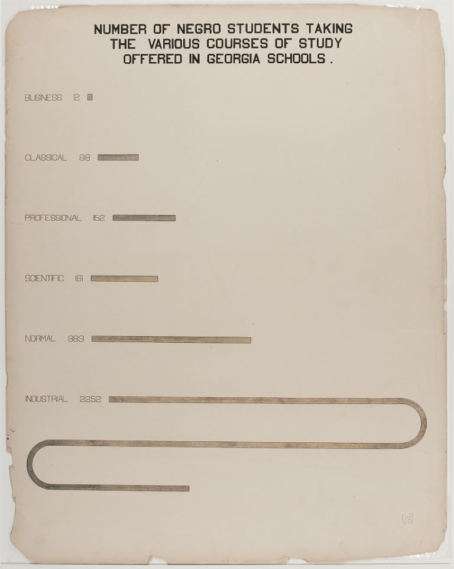|
|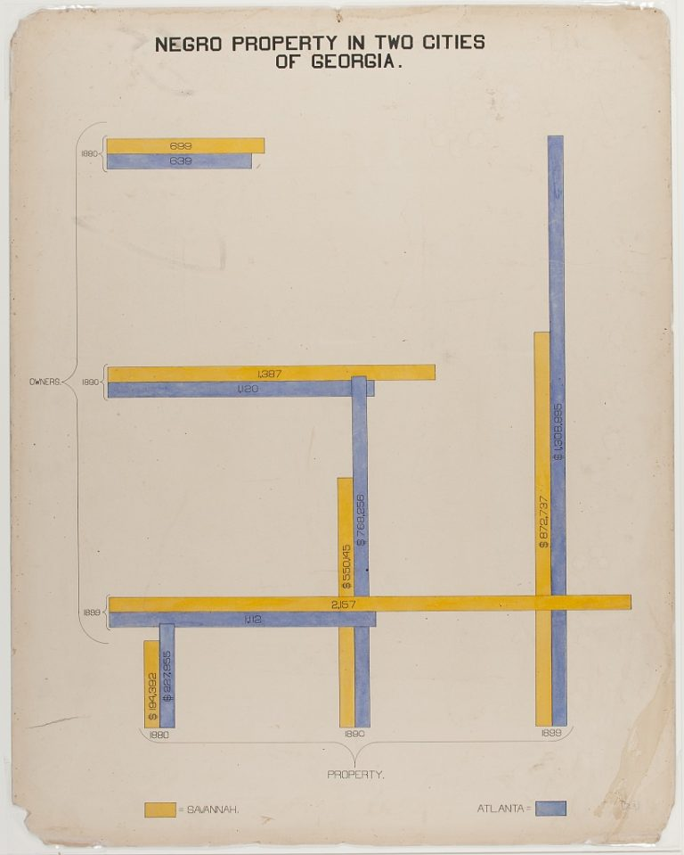|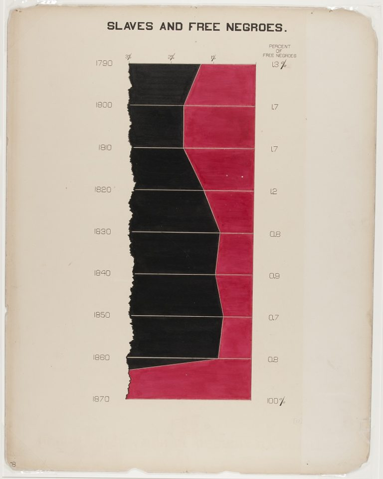|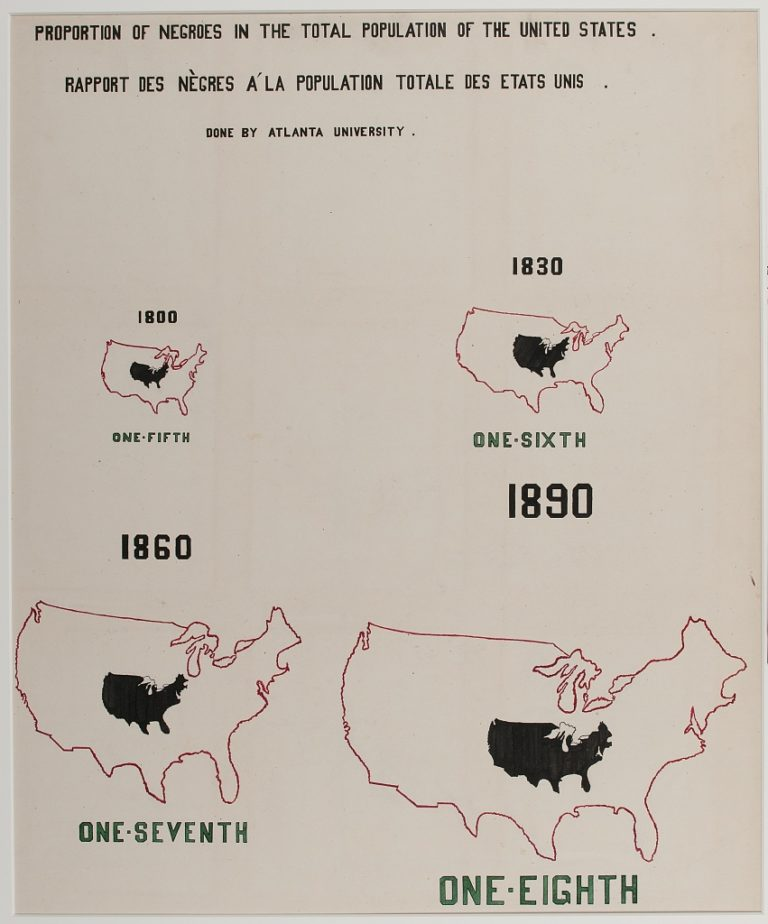|
|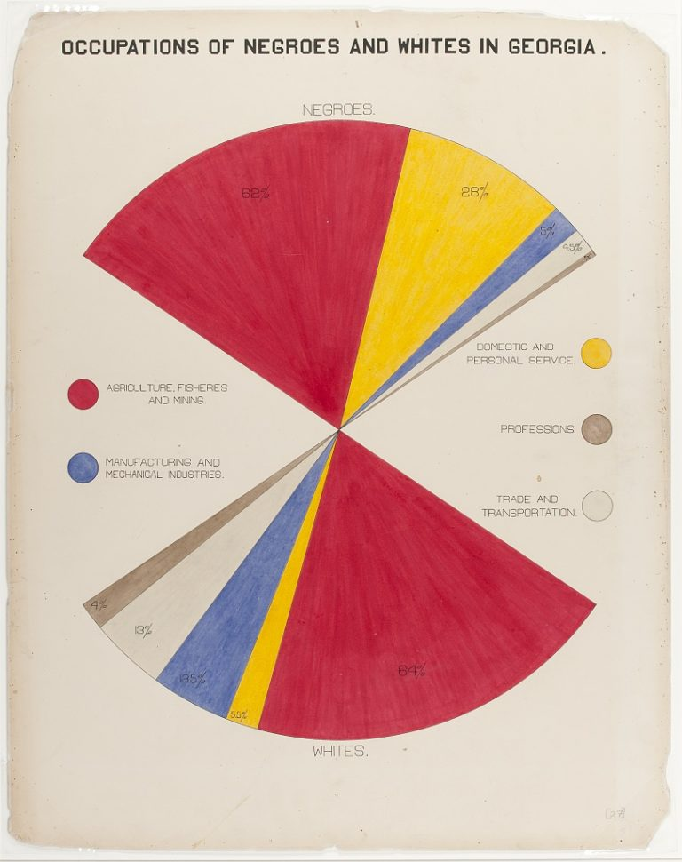||| 

> [Images source](http://www.loc.gov/pictures/search/?q=%22lot%2011931%22%20NOT%20medal&st=grid&co=anedub&loclr=blogpic) and [a blog post about them](https://hyperallergic.com/306559/w-e-b-du-boiss-modernist-data-visualizations-of-black-life/).

### Activities / datasets

- Election maps
- 52% v 48% bar charts

- Visualizations about NYC water sources? (NY Historical Society)

