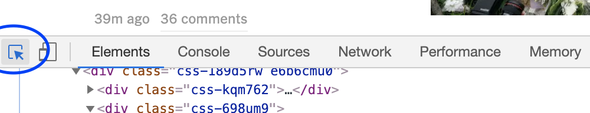

# Basic HTML

## Learning Objectives

* SWBAT use the element inspector to examine rendered HTML.
* SWBAT create a new `.html` file with the HTML shell.
* SWBAT add paragraph and heading elements to an HTML page.
* SWBAT add images to an HTML page.
* SWBAT add `a` hyperlinks to their code.
* SWBAT differentiate between elements that have both opening and closing tags, and elements which are self-closing.
* SWBAT use element level selectors to style their code in CSS.

## Sequence

1. [HTML Elements](#html-elements)
2. [URLs](#urls)
3. [Structures](#structures)
4. [Colors](#colors)

## Launch

The launch should likely be differentiated based on the prior knowledge of students.

_NOTE that if students have not worked with HTML before, you'll likely want to split this content up into 2-4 lessons, and not touch CSS at all on day 1._

##### If most of your students HAVE NOT worked with HTML before:

Send students to the New York Times website. Ask them to make a list of everything they notice. You'll get lots of answers, but be sure to garner these:
* Text
* Images
* Clickable links (that take you to other pages)

Students may also notice colors, fonts, layout, etc. Honor these contributions and explain that they're up next, but that we won't be covering them today.

Then, open up the [Chrome inspector](https://developers.google.com/web/tools/chrome-devtools/shortcuts) and model for students how to see what type of tags are used to create each element on screen using the element inspector  - point out the color coding to keep attuned to the correct items. Have them make a list of every element they can find using the inspector.

They'll find WAY more than you can teach in 40 minutes, so skip down to the `framing` section so they know which items we will be prioritizing.

##### If most of your students HAVE worked with HTML before:

In this course, we're ultimately going to work with a framework called React.js, which allows us to assemble HTML pages dynamically in JavaScript - but HTML rendered in React.js is a bit less forgiving than vanilla HTML. Every single element that is opened must also be closed, so skip down to the `optional nesting activity` to help frame this for students.

## Framing

The most frustrating part of teaching HTML arises in how ugly pure HTML is on the page. Students will crave the capacity to center items, color text and backgrounds, and add fonts. Clarify the sequence for them; let them know they're welcome to break the sequence, but if they do, they'll likely learn *a* way to do it, but not the most effective way to do it, and they'll be asked to do it a different way later. If they're willing to be patient, here's what we'll eventually cover.
1. We're going to put TEXT on a page.
2. We're going to put OBJECTS like hyperlinks and images on a page.
3. We're going to put organizational structures like lists on a page.
4. We're going to add color to elements on the page.
5. We're going to make an intentional layout for the page.
6. We're going to add a font to the page.

The playtime sections of each major component of this lesson include recommended jumping off points which are generally sequenced in gradually increasing difficulty. Present these as breadcrumbs for students, and encourage them to tackle all of the listed elements/concepts/properties first, and THEN feel free to jump into exploring whatever interests them, and clarify that most students won't even get through the breadcrumbs - that there's NO pressure to move beyond the breadcrumbs, or even try them all.

## HTML Elements

HTML requires less introduction than you might think. The most foundational understanding you can build in students is the realization that there are essentially two types of elements: containers and objects. MOST of what they put on a page will be a container, a few things will be objects.

*It's worth naming that container and object are both very broad terms used in a lot of programming frameworks - they are not technically precise here. Feel free to use whatever terminology works best for you*

###### Optional Activity: Real-World Nesting Analogy

Here's a list of things, mostly in NYC. Your challenge, on whiteboards, is to come up with some visual representation of this information. Most importantly, I want to be able to understand **what is contained inside of what**.
* USA
* New York
* Tennessee (or wherever)
* Nashville (or wherever)
* New York City
* Brooklyn
* Manhattan
* Queens
* Central Park
* Prospect Park
* The Obelisk
* The Museum of Natural History
* The Museum of the Moving Image
* A blue whale
* Anything else you know of and can fit into your organizational structure.


Students will take about 3 minutes, and usually create concentric circles, a visual hierarchy, or something similar. Before presenting the code below, ask students to somehow identify each item in their hierarchy as either a container, or an object. Students will quickly realize that *most* HTML elements are containers, and only the obelisk and blue whale are objects (non-containers).

*Obviously, consider reorienting the TN section according to your personal background.*

```
<USA>
  <state id="New York">
    <city id="NYC">
      <area class="borough" id="Brooklyn">
        <park class="public free" id="ProspectPark">

        </park>
      </area>

      <area class="borough" id="Manhattan">
        <park class="public free historic" id="CentralPark">
          <landmark id="theObelisk" />
        </park>
        <museum class="science" id="MuseumOfNaturalHistory">
        </museum>
      </area>

      <area class="borough" id="Queens">

      </area>
    </city>
  </state>

  <state id="Tennessee">
    <city id="Nashville">
      <street id="AndrewCrockettCt">
        <house id="1725">
          Robin and Marty!
        </house>
        <house id="1727">
          Jeff's parents!
        </house>
        <house id="1729">
          Gene and Judy!
        </house>
      </street>
    </city>
  </state>

</USA>

```

When you present this code, clarify that it adheres to HTML syntax, but is not functional HTML. Ask questions about where elements end, and which elements are INSIDE of other elements, for example:
* On what line does Prospect Park end?
* Which elements is the Museum of Natural History inside?
* Which element is it adjacent/next to?

#### Hello World!

Put the first h1 inside the body, and walk the students through their first preview. Challenge students to put another h1 after the first one.

```html
<!DOCTYPE html>
<html>
  <head>
    <meta charset="utf-8">
    <title></title>
  </head>
  <body>
    <h1>Hello World!</h1>
  </body>
</html>
```

#### Playtime (5-8 minutes)

Challenge students to create a profile page for their immediate neighbor. Have them build on the skeleton code you wrote in the previous section. Ask them to include at least:
* Name
* Birthday
* School
* Interests (shows, books, subjects in school, etc.)

Challenge students to utilize the following elements:
* h1
* h3
* p (at least three)

#### Takeaways

* HTML - Place header and paragraph elements on a page

## URLs

Let's look at a w3schools reference to determine how to put anchor tags and images on a page.

#### Reading documentation

Ask students how developers learn new things, or how they remember old things. Do they just memorize everything useful? *no, developers need reference material to learn new skills, and to brush up on old skills or languages they don't use often in their day-to-day work.*

We're going to use w3schools for HTML, as it's the clearest documentation for HTML we've found on the web. Coach students through how to use the "try it yourself" button on the [anchor tag page](https://www.w3schools.com/tags/tag_a.asp).

#### Playtime

Challenge students to add to the profile they are building:
* An anchor tag hyperlink to the subject's favorite webpage.
* An image tag with either the person's profile picture, or the person's favorite cartoon character.
* An iframe with an embedded website. *stretch*

#### Takeaways

* HTML - Use IMG tags (local source, and source on the web)
* HTML - Explain the difference between elements that have opening and closing tags (most of them) and elements that do not (images, horizontal rules, css links, etc.)
* HTML - Create anchor tags

## Structures

Debrief the previous activity by identifying that while MOST elements have opening and closing tags, a few (specifically images) have only one tag. Ask students why an image doesn't have a closing tag (or why it's closed within a single tag, depending on syntax). *Because you can't put additional content inside an image - the image itself is the content.*

Direct them to the documentation for an ordered and unordered list. Launch after clarifying that there are three new tags they'll be learning to use: an ordered list, an unordered list, and a list item.

#### Playtime

* Add a list to their profile piece.
* Add a table to their profile page.
* Add a form to their profile page.

#### Takeaways

* HTML - Create ordered and unordered lists *(stretch)*
* HTML - Create tables *(stretch)*
* HTML - Create forms, including various inputs: text, password, number, date, radio, checkbox, button, submit *(stretch)*

## Colors

Verify that every student has at least 1 paragraph element on their page (preferably three). Then code this out with them.

```HTML
<!DOCTYPE html>
<html>
  <head>
    <meta charset="utf-8">
    <title>Test Page</title>
    <style media="screen">
      p {
        color: red;
      }
    </style>
  </head>
  <body>
    <h1>Hello world</h1>
    <p>Lorem ipsum dolor sit amet, consectetur adipisicing elit, sed do eiusmod tempor incididunt ut labore et dolore magna aliqua. Ut enim ad minim veniam, quis nostrud exercitation ullamco laboris nisi ut aliquip ex ea commodo consequat. Duis aute irure dolor in reprehenderit in voluptate velit esse cillum dolore eu fugiat nulla pariatur. Excepteur sint occaecat cupidatat non proident, sunt in culpa qui officia deserunt mollit anim id est laborum.</p>
    <p>Lorem ipsum dolor sit amet, consectetur adipisicing elit, sed do eiusmod tempor incididunt ut labore et dolore magna aliqua. Ut enim ad minim veniam, quis nostrud exercitation ullamco laboris nisi ut aliquip ex ea commodo consequat. Duis aute irure dolor in reprehenderit in voluptate velit esse cillum dolore eu fugiat nulla pariatur. Excepteur sint occaecat cupidatat non proident, sunt in culpa qui officia deserunt mollit anim id est laborum.</p>
    <p>Lorem ipsum dolor sit amet, consectetur adipisicing elit, sed do eiusmod tempor incididunt ut labore et dolore magna aliqua. Ut enim ad minim veniam, quis nostrud exercitation ullamco laboris nisi ut aliquip ex ea commodo consequat. Duis aute irure dolor in reprehenderit in voluptate velit esse cillum dolore eu fugiat nulla pariatur. Excepteur sint occaecat cupidatat non proident, sunt in culpa qui officia deserunt mollit anim id est laborum.</p>
  </body>
</html>
```

Ask students to predict which things will be red before previewing this page. Then, have them try another color.

#### Playtime

Challenge students to add other [styling properties](https://www.w3schools.com/cssref/default.asp) to the paragraph selector:
* background-color
* font-size
* text-align
* text-shadow
* border

Challenge students to style other elements, like the h1 or h3 elements.

## Close

Remember to gather student feedback on this lesson. In addition to the standard close, consider priming students for feedback with the following questions.

#### Questions for Students
* What errors / mistakes did you find easiest to make?
* What do you still want to learn?
* What's missing that separates your site from the New York Times website?
