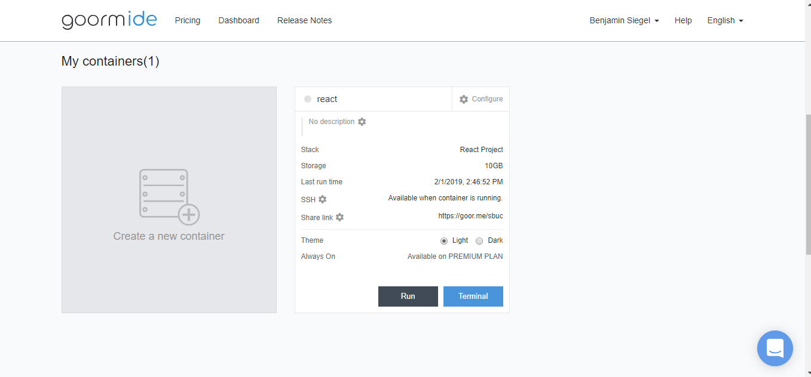
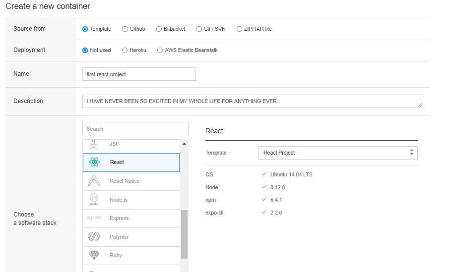
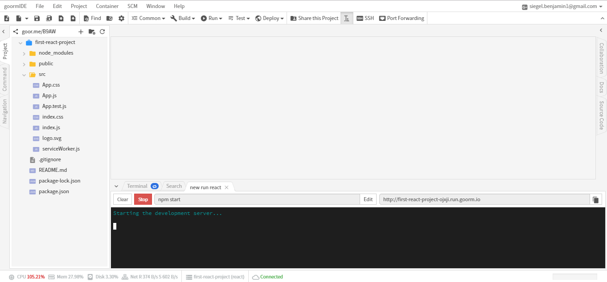

## Goorm Setup

#### Step 1

Create a new container in Goorm.

#### Step 2

Choose React as your software stack.

#### Step 3

Open the "src" directory in your project. Then, open `App.js` and look at the code written in the file. This file contains the code on what the user will see. Take a guess what you might see when you run this code. Then, run the code by clicking the "Run" button from the top of the menu. After you press "Run" a link will appear on the lower right side of your screen. Copy that link into a new tab and take a look!

#### Step 4

You should see a page that looks like this. Was it as you expected? Also - notice how it tells us to edit src/App.js - lets try it out and see what happens.

#### Step 5

Go back to the `App.js` file and delete the code inside of the `div` with the class name `"App"`.

Try adding some HTML to get "Hello World" to appear on the web page instead!

