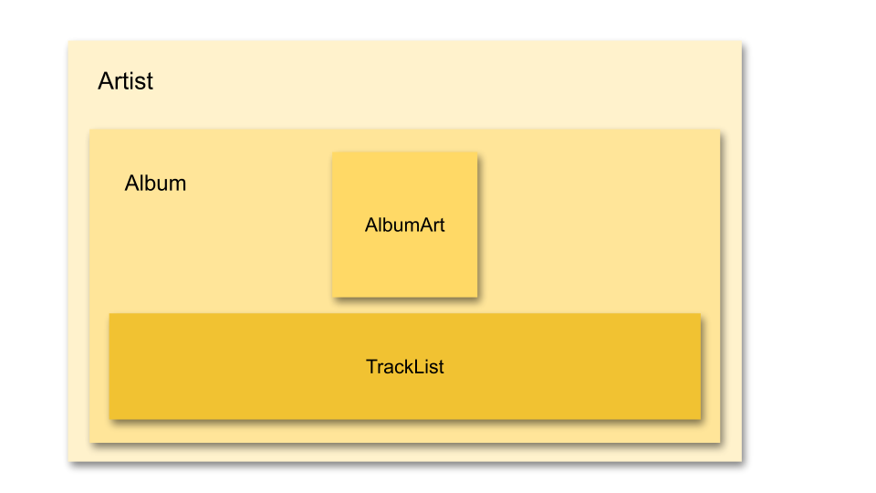

# Parent & Child Components

## Learning Objectives

- SWBAT articulate the difference between parent and child components
- SWBAT break down a page into parent and child components
- SWBAT rearrange existing code into parent and child components
- SWBAT pass props from parent components to child components

## Sequence

1. [Launch](#launch)
2. [Parents & Children](#parents--children)
3. [Rearranging Components](#rearranging-components)
4. [Passing Props from Parent to Child](#passing-props-from-parent-to-child)
5. [Close](#close)

## Launch

Let's all clone [this repository](https://github.com/upperlinecode/react-parent-child-lecture) and take a look at the code.

Based on what you know so far, how would you accomplish the following modifications to this digital yearbook mockup for Glenbrook North High School:

- Add an "Honors" section for each student.
- Make all Senior quotes in _italics_.
- Move each student's name above their picture.

#### Questions for students

- How tedious did you think it would be to make those changes?
- Can you think of a more efficient way to arrange the code so that changes like those are not so laborious?

## Parents & Children

As you've seen, it's possible to break code up into functional components to make it easier for a developer to manage the code in different parts of a React app. It's worth recognizing, however, that components can use (or be used by) other components. This makes code a bit more structurally semantic (it gives it more meaning), instead of just duplicating the way you might build an app in HTML.

> Explore [this repository](https://github.com/upperlinecode/react-parent-child-lecture-nesting) to demonstrate the following description of nested components. Either `clone` the repository, `npm install` then `npm start`, or explore the code in the `src/` subfolder.

When component A uses component B as part of its `return` statement, component A is referred to as the "parent" of component B, and component B is referred to as the "child" of parent A. Component B could, in turn, be built from other components - say components C and D. In this case, component B is the "parent" of components C and D, and components C and D are the "children" of component B. Component B is the "child" of component A and the "parent" of components B and C.

#### `./ComponentA.js`
```javascript
import React from 'react'
import ComponentB from './ComponentB'

const ComponentA = () => {
  return (
    <ComponentB />
  )
}

export default ComponentA
```

#### `./ComponentB.js`
```javascript
import React from 'react'
import ComponentC from './ComponentC'
import ComponentD from './ComponentD'

const ComponentB = () => {
  return (
    <div>
      <ComponentC />
      <ComponentD />
    </div>
  )
}

export default ComponentB
```

#### `./ComponentC.js`
```javascript
import React from 'react'

const ComponentC = () => {
  return (
    <div>
      // Some code
    </div>
  )
}

export default ComponentC
```

#### `./ComponentD.js`
```javascript
import React from 'react'

const ComponentD = () => {
  return (
    <div>
      // Some code
    </div>
  )
}

export default ComponentD
```

The parent-child relationship is all about nesting.



What happens when you:

- add an additional `ComponentA` in `App.js`?
- add an additional `ComponentB` in `ComponentA`?
- add an additional `ComponentC` in `ComponentB`?

#### Mini-Challenges

- Revisit the app we started with, and think about how it could be rearranged into nested components.
- Map out (on paper) the nested structure of the app into granular sub-components. What is/are the most granular functional components you would make?

## Rearranging Components

Now that you've had a chance to think about how to restructure the app above, try to implement that restructuring:

1. Break apart the code into functional components
  1. Tip: start by breaking the code into large components, then try to break those components into smaller components.
  2. Keep an eye out for any code you might be able to package into a component and reuse.
2. Keep breaking the code into separate functional components until you are satisfied that the functional components are as granular as they should be.
  1. Remember to include the necessary `import` and `export` statements when you create new functional components:
  ```javascript
  import React from 'react'
  import AnotherComponent from './AnotherComponent'

  const ComponentName = () => {
    return (
      // Some code
    )
  }

  export default ComponentName
  ```
  2. Remember to include a new `import` statement wherever you use a new functional component.
  3. Remember to replace the code you abstract into the functional component with the component name: e.g. `<ComponentName />`.

## Passing Props from Parent to Child

Now that you've seen how to break up a page into components, let's take a step back and think about the data that flows into a webpage which is rearranged into what is displayed on that page. This data most often comes as a list, array, or object, where each component that is shown is a list entry and each entry contains all of the information necessary for the component.

You've already seen how functions like `.map()` can make quick work of iterating over an array in order to return a new array or new HTML. By extension, `.map()` can also be used to quickly generate the JSX for components in a React app.

But, as you've just learned above, components can be made from nested components which themselves may nest components. To understand how that top-level data is passed to the correct component which will display it, we need to understand "prop drilling". "Prop drilling" is how props can be passed from parent to child, then to a child of that child, and so on until the value reaches the depth containing the component where it is displayed.

Let's revisit our nesting example above to see how data could be passed from `ComponentA` through `ComponentB` to `ComponentC` and `ComponentD`. Consider the following components:

#### `./ComponentA.js`
```javascript
import React from 'react'
import ComponentB from './ComponentB'

// this data might come from a database or a music service like spotify
let data = {
  "artist": "My favorite singer",
  "album": "Their best album",
  "image": "albumCover.png",
  "tracks": [
    {
      "id": 1,
      "title": "Opening Song",
      "duration": "2:31",
      "comment": "makes me want to dance"
    },
    {
      "id": 2,
      "title": "Second Song",
      "duration": "3:12",
      "comment": "always skip this one"
    },
    {
      "id": 3,
      "title": "Third Song",
      "duration": "5:33",
      "comment": "my favorite!"
    }
  ]
}

const ComponentA = (data) => {
  return (
    <div>
      <h1>data.artist</h1>
      <ComponentB data=data/>
    </div>
  )
}

export default ComponentA
```

`ComponentA` receives the `data` (from some database or some API call) and renders the artist name in an `<h1>`. However, the rest of the data isn't used in `ComponentA`, so the entire data object is passed as a prop called `data` to `ComponentB`.

#### `./ComponentB.js`
```javascript
import React from 'react'
import ComponentC from './ComponentC'
import ComponentD from './ComponentD'

const ComponentB = (props) => {
  return (
    <div>
      <h3>{props.data.album}</h3>
      <ComponentC image={props.data.image}/>
      <ComponentD songs={props.data.tracks}/>
    </div>
  )
}

export default ComponentB
```

`ComponentB` receives the `data` as props, and renders an `<h3>` showing the name of the album. Note: we could imagine making some small updates to this code in order to show multiple albums, right?

The remaining data, however, doesn't get used by `ComponentB`. In this case `ComponentC` might show album artwork and `ComponentD` could show a tracklist. Data from `props` is passed to each of those components as `image` and `songs`, respectively, but those props could have been called anything.

#### `./ComponentC.js`
```javascript
import React from 'react'

const ComponentC = (props) => {
  return (
    <div>
      
    </div>
  )
}

export default ComponentC
```

`ComponentC` receives a single prop, `image`, and then uses it to render the album artwork. There are no more nested components that will need any additional data here...

#### `./ComponentD.js`
```javascript
import React from 'react'

const ComponentD = (props) => {
  return (
    <ul>
      {
        props.songs.map(tune => {
          return "<li>" + tune.title + "</li>";
        })
      }
    </ul>
  )
}

export default ComponentD
```

`ComponentD` receives a single prop, `songs`, which is an array of objects listing out the songs in that album. You could imagine using `.map()` to iterate over that list to make a bulleted list of tune titles (shown), or even to make it more complex so you could link out to play the songs, etc. But after this component, there are no more nested components that will need any additional data...

## Close

Think back to the three changes that you were asked to make at the beginning of this lesson. Take a moment to make those changes to your app now that you've broken it apart into nested functional components:

- Add an "Honors" section for each student.
- Make all Senior quotes in _italics_.
- Move each student's name above their picture.

> It's possible that you may have to duplicate components that are used elsewhere in order to make changes in only certain circumstances. Don't forget to create a new component name, export it, and import it (where necessary).

#### Questions for students

- Was it easier/harder to make the changes now that you've restructured the app?
- What are the challenges to working with an app that has a lot of child components, many of which might have child components, some of which might have child components?
