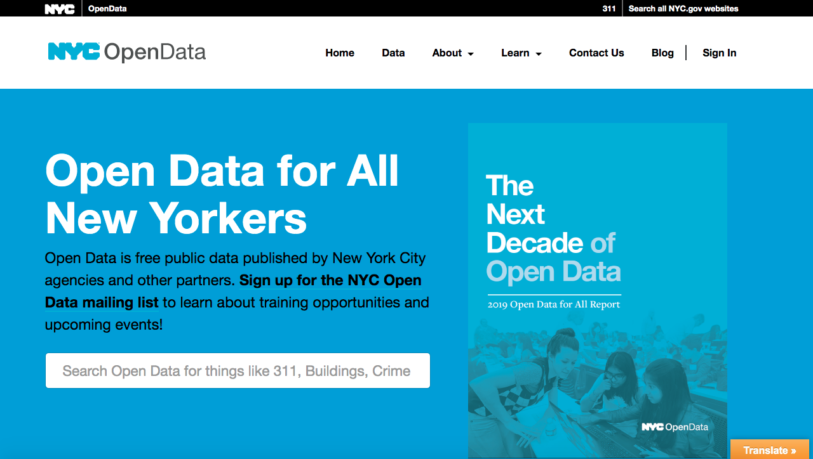
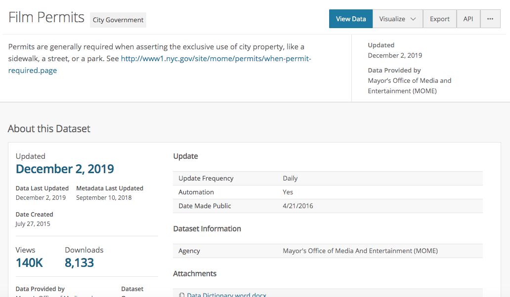
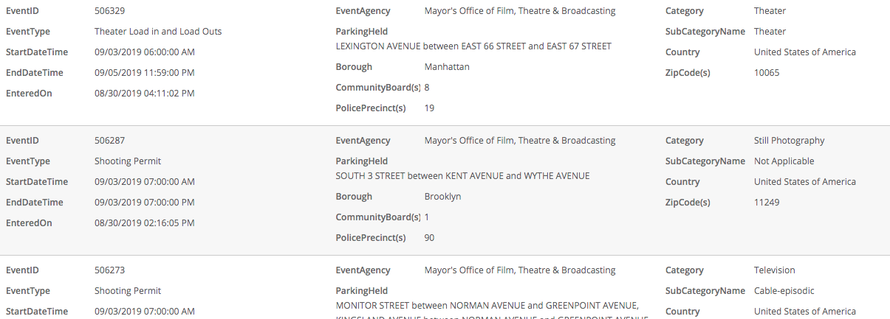
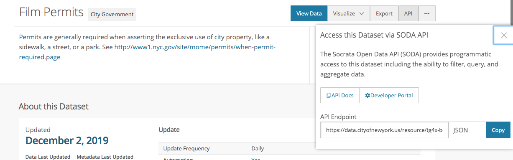
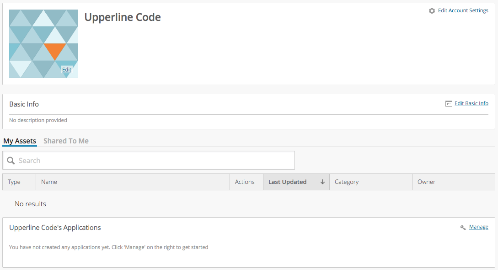
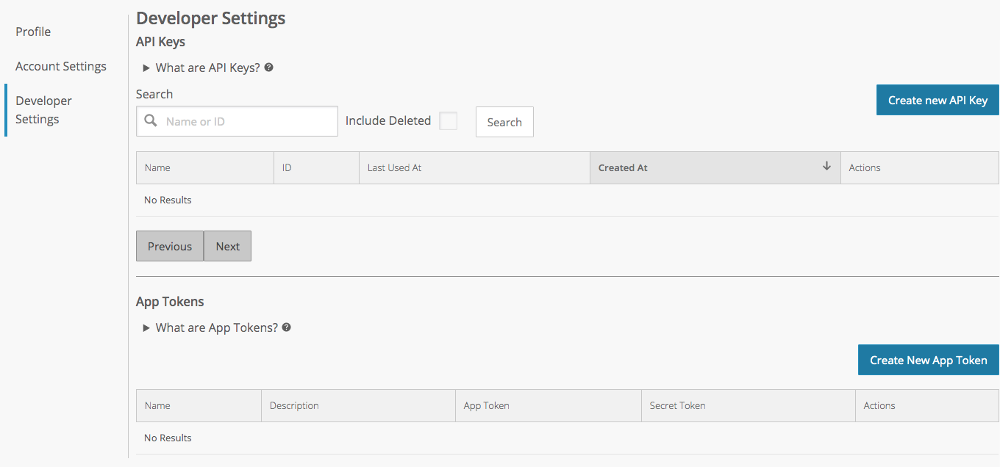
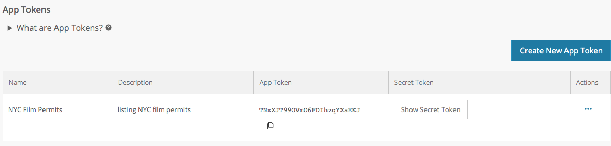

# APIs in React

## Learning Objectives

- SWBAT read developer documentation to construct an API call
- SWBAT read developer documentation to interpret an API response
- SWBAT request data from NYC Open Data
- SWBAT integrate API data into a React component

## Sequence

1. [Launch](#launch)
2. [APIs Overview](#apis-overview)
3. [Viewing Data](#viewing-data)
4. [APIs + JavaScript](#apis--javascript)
5. [NYC Open Data APIs](#nyc-open-data-apis)
6. [Close](#close)

## Launch

Click on this url: [http://jservice.io/api/random?count=1](http://jservice.io/api/random?count=1)

- What do you see when you click on that URL?
- Does the result look familiar? What's the name of the format you see?
- Look closer: can you find the trivia question?
- Look closer: can you find an answer to the trivia question?

> Using a browser plugin like [JSON Formatter (Chrome)](https://chrome.google.com/webstore/detail/json-formatter/bcjindcccaagfpapjjmafapmmgkkhgoa) will reformat that site to make it easier to read.

The [jservice.io](http://jservice.io/) site is a place where you can go to access over 156,800 trivia questions. We've reformatted one of the trivia questions below so you can more easily inspect the data you get from this API.

```javascript
[{
	"id": 117776,
	"answer": "the Globe",
	"question": "This London theatre was razed in 1644, 2 years after the Puritans closed it down",
	"value": 800,
	"airdate": "2013-04-05T12:00:00.000Z",
	"created_at": "2014-02-14T02:47:13.857Z",
	"updated_at": "2014-02-14T02:47:13.857Z",
	"category_id": 306,
	"game_id": null,
	"invalid_count": null,
	"category": {
		"id": 306,
		"title": "potpourriiii",
		"created_at": "2014-02-11T22:48:12.939Z",
		"updated_at": "2014-12-08T12:51:44.677Z",
		"clues_count": 320
	}
}]
```

> Note: the data above is an array containing a single object. This will become important later when we use data in React.

- What if you wanted 20 questions instead of just 1? How would you change the URL to get more results?

## APIs Overview

An API, or an Application Programming Interface, is a way of reading data from, or writing data to, a database that you don't necessarily own. Although some developers do set up and use their own APIs, here we'll focus on using other people's APIs to get their data.

APIs are great because we can hook into a service - that is maintained by someone else - to ensure that our app is always showing current data. For instance, let's say you want to build a weather app. Would you rather maintain a database of the weather in every location in the world? Or would you rather tap into a meterological database where they're already doing that?

Using an API involves two steps:

1. The Request: a request is where you're asking for someone else's data, and you typically need to specify what data you want according to the rules that the database owner sets up. Those rules are documented in developer documentation.
2. The Response: if the database accepts your request, then it sends back a response. The response is the data you've asked for, and the structure of the response data is typically also documented in developer documentation.

Have you ever noticed how the google URL changes when you google something? The URL is the request, and the data on the search results page is the response.

Can you guess what data this URL will show?: [https://www.google.com/search?q=red+lobster](https://www.google.com/search?q=red+lobster)

Now click on the URL. What happens if you change part of the URL from `red+lobster` to `blue+lobster`?

## Viewing Data

Most API requests are built from three parts:

1. An Endpoint: an endpoint is the stem of the request URL. For the example above, the endpoint is `https://www.google.com/search`.
	> For the first example we saw, the endpoint is `http://jservice.io/api/random`.
2. Parameters: parameters are the variables that are passed to the database as part of the request and follow the `?`. For the example above, there is one parameter, `q`.
	> For the first example we saw, the parameter was `count`.
3. Values: values are paired with variables and are the data that is passed to the database in the request. For the example above, the value `red+lobster` is paired with the parameter `q`.
	> For the first example we saw, the value was `1`.

> Note: when there are multiple parameters and variables passed to an API, the parameter/variable pairs are separated by an `&` symbol.

Not all API requests will return the data for a webpage like Google search results; some APIs like jservice.io just return raw data.
	
- For more on working with JSON data, see the [JSON & Firebase](json-firebase.md) mini-unit
- APIs can also be used to write data. To learn more about writing data to a database, see the [JSON & Firebase](json-firebase.md) mini-unit

## APIs + JavaScript

Now that you see how an API is a request for data, you'll probably want to use that data somewhere in an app. Although there are a number of ways of making API requests using JavaScript (e.g. using [vanilla JavaScript](https://plainjs.com/javascript/ajax/send-ajax-get-and-post-requests-47/) or [jQuery](https://www.w3schools.com/jquery/ajax_ajax.asp)), we're going to focus on how to integrate API requests with React.

Before jumping into React, however, we need to strategize a bit about how we want to use APIs to make for a seamless user experience.

### Async & Await

When we make a request to an API, sometimes it takes a bit of time for the API to respond. So if we wait to fully load a webpage until the API responds, we might be making our user wait a long time before the page loads, if it even loads at all. In the worst case scenario, if we wait to load a page until an API responds and the API never responds, then the page will never load and the user will have a terrible experience; we can't rely on the success of a call to the API in order to load the page.

To overcome this problem, we need to use a way of calling the API where the call is done as soon as a page loads, and then the response (or lack thereof) can trigger a secondary event such as rendering the data. This pattern of requesting data in parallel to the normal loading order of the page is done using a "promise" pattern called `async` (for asynchronous). Then, the code will `await` a response from the API, and depending on the response - usually either `success` or an `error` - will do something. `async` and `await` are useful because they won't block the rest of the page from continuing to load even though data hasn't been received yet.

### Using `async` & `await`

There's a lot to be said about using `async` and `await` properly, and there's a lot of complexity to handling and manipulating promises efficiently, but the basic anonymous version of the `async-await` functional pattern (with error handling) is below:

```javascript
(async () => {
  try {
    let response = await fetch('https://someAPIcall');
    // other await statements could go here

    // other code to execute once response is defined
  } catch(err) {
    // catches errors in any of the await statements in try {}
    alert(err);
  }
})();
```
- the `async` keyword is placed before the function to define it as an asynchronous function and to indicate that it will return a promise
- `try ... catch` is used to handle any errors that might result from an unsuccessful API request
- `await` makes JavaScript wait until the `fetch()` request has returned a result
> Note: `await` only works within an `async` function

So the anonymous function will wait for `https://someAPIcall` to return a result. If it does return a result, then it will store that as the `response` variable and then do something with it. If the request throws an error, then the function will do what's the in the `catch` code block, in this case showing an `alert()` with the error.

> Note: you may also come across a different pattern that uses `.fetch()`, `.then()`, and `.catch()` to handle API data. It is similar to `async await` in that `.fetch()` is used to make a request, `.then()` indicates what to do once a response is received (and any steps thereafter), and `.catch()` indicates how to handle errors. It doesn't, however, operate asynchronously so it will block the page loading until the promise resolves.

### Using `async` & `await` in React

Now that we know what an API is and how it works, and how to make `async` API requests, we can see how to make an API call in React.

API calls are typically done in the `componentDidMount` method of a component, and we can identify `componentDidMount` as an `async` function in order to use `async await` and `try ... catch` as part of the method:

```javascript
import React from 'react';
// any other import statements

const Item = () => {
  const component = new React.Component();
  component.state = {
    // define state variables here
  }

  async component.componentDidMount = () => {
    try {
      let response = await fetch('https://someAPIcall');
      // other await statements could go here

      // other code to execute once response is defined
    } catch(err) {
      // catches errors in any of the await statements in try {}
      alert(err);
    }
  }
  
  component.render = () => {
    return (
      // render component HTML here
    )
  }

  return component;
}
   
export default Item;
```
> Note: you can use `setState` within the `componentDidMount` method to update any state variables

## NYC Open Data APIs



New York City provides free access to numerous data resources on the [NYC Open Data](https://opendata.cityofnewyork.us/) website. There you can [search for datasets](https://opendata.cityofnewyork.us/data/) of city-related data, including 311 calls, restaurant inspection results, geographic datasets, and much much more.

> Because NYC Open Data is coming from a variety of city departments, there's some variability in the quality, utility, and completeness of the data.

The best way to learn how to use the data at NYC Open Data is to dive in, find the API developer documentation, and begin to get some data.

Let's say we're interested in NYC Film Permits, and we find the dataset below:


Clicking on the title leads to a page with more information about the dataset.

There we can see how many rows are in the dataset (62.6K), how many columns it has (14), how often it's updated (daily), how many people have downloaded it (over 8,100), etc.



At this point, if we weren't sure whether this dataset is useful to us, we could click on the "View Data" button where we can begin to get a sense of what data is in the Film Permits dataset. There, you can view the data in a big table (like in Excel or Google Sheets) or one record at a time:



The dataset has over 62,600 records, and that many records is too cumbersome to load into our app directly! We'll need to use an API.

To get to the API version of the dataset: from the information page, we can click on the "API" button (a few over from the "View Data" button). That will show a modal window with information about the Socrata Open Data API (SODA), including links to the [API documentation](https://dev.socrata.com/foundry/data.cityofnewyork.us/tg4x-b46p), the [Socrata portal homepage](https://dev.socrata.com/), and the raw API data, e.g. [https://data.cityofnewyork.us/resource/tg4x-b46p.json](https://data.cityofnewyork.us/resource/tg4x-b46p.json).



### Getting an App Token

Although it may seem like we're good to go now that we know the endpoint for the dataset (the JSON file linked above), Socrata puts a limit on how many times we can access that data without an Application Token. That means we need to [register an Application Token](https://dev.socrata.com/register) (and also create an Account on Socrata):

1. Sign up for a Socrata Account here: [opendata.socrata.com/signup](https://opendata.socrata.com/signup)

2. If you're not directed to the Developer Settings, from the bottom of your profile page, tap the "Manage" link in the top-right corner of your "Applications" list.


3. Tap the "Create New App Token" button, fill in the required information about the app/dataset you're using, and then tap "Save".


4. You'll see your new App Token in the list below the button:


> Note: you get a public and a private App Token - keep the secret token secure and don't share it with others (or in a github repository). Although we won't be using it here, there are other APIs for which you may need to use the secret token to access data.

### Using Our App Token

Now that we have an App Token, we can start to make requests of the API!

According to the [Socrata documentation](https://dev.socrata.com/docs/app-tokens.html), we can append the variable `$$app_token` to the endpoint along with our App Token in order to make the request:

```javascript
https://data.cityofnewyork.us/resource/tg4x-b46p.json?$$app_token=TNxXJT9OVmO6FDIhzqXYaEKJ
```

Try using _your_ App Token with the endpoint above to get the raw data.

> Note: I've altered the App Token above so you will receive a permissions error if you try to use the token shown. You will know your App Token works because you will get data back from the URL.

### Filtering Data from Socrata

Socrata includes a simple way to [filter data](https://dev.socrata.com/docs/filtering.html) in API requests: by using column names as parameters.

The NYC Film Permit data has 14 columns, one of which indicates the `borough` in which filming will take place:

```javascript
// 14 fields for each entry in dataset
"eventid"
"eventtype"
"startdatetime"
"enddatetime"
"enteredon"
"eventagency"
"parkingheld"
"borough"
"communityboard_s"
"policeprecinct_s"
"category"
"subcategoryname"
"country"
"zipcode_s"
```

To use the `borough` parameter to filter to only the permits granted in Manhattan, we can append `&borough=Manhattan` at the end of our request URL (which already includes our App Token):

```javascript
https://data.cityofnewyork.us/resource/tg4x-b46p.json?$$app_token=TNxXJT9OVmO6FDIhzqXYaEKJ&borough=Manhattan
```

Try using _your_ App Token with this endpoint and parameter/variable to get filtered raw data.

#### More Complex Filtering

What if you wanted to get all of the Film Permits _except_ for the ones in Manhattan?

Socrata has more complex filtering capabilities using [SoQL clauses](https://dev.socrata.com/docs/queries/). We might construct the query above using the `$where` parameter, but in this case the variable is an inequality that indicates how to filter the data, e.g. `$where=(borough!="Manhattan").

```javascript
https://data.cityofnewyork.us/resource/tg4x-b46p.json?$$app_token=TNxXJT9OVmO6FDIhzqXYaEKJ&$where=(borough!=%22Manhattan%22)
```

> Note: the parentheses are not necessary, however they're included for readibility.
> Note: `%22` is the HTML character code for `"`.

### Getting NYC Open Data into React

Pulling together our React component and our NYC Open Data (Socrata) API request, we end up with a React component that's requesting data from Socrata:

```javascript
import React from 'react';
// any other import statements

const Item = () => {
  const component = new React.Component();
  component.state = {
    // define state variables here
  }

  async component.componentDidMount = () => {
    try {
      let response = await fetch('https://data.cityofnewyork.us/resource/tg4x-b46p.json?$$app_token=TNxXJT9OVmO6FDIhzqXYaEKJ&borough=Manhattan');
      // other await statements could go here

      // other code to execute once response is defined
    } catch(err) {
      // catches errors in any of the await statements in try {}
      alert(err);
    }
  }
  
  component.render = () => {
    return (
      // render component HTML here
    )
  }

  return component;
}
   
export default Item;
```

At this point, it's worth re-recognizing that the API's response, the variable `response` above, is an array of objects. We already know how to use `.map()` and other JavaScript functions on an array of objects to manipulate and return HTML in a React component! Yay!

### Visualizing API Data

If you've completed the [Victory](victory.md) mini-unit, you can also consider how you might visualize or graph data returned from an API.

## Close

Successfully using APIs to get data is all about knowing the data you need, finding a source for that data, and being able to access it via a URL.

In order to implement APIs in React, we've also covered two more-technical strategies: leveraging the `componentDidMount` method in React and using `async await` and `try ... catch` to asynchronously request data while handling errors that may result.

At this point, we encourage you to explore the [NYC Open Data Portal](https://opendata.cityofnewyork.us/) for data that you find interesting and would like use in a creative and meaningful way.
