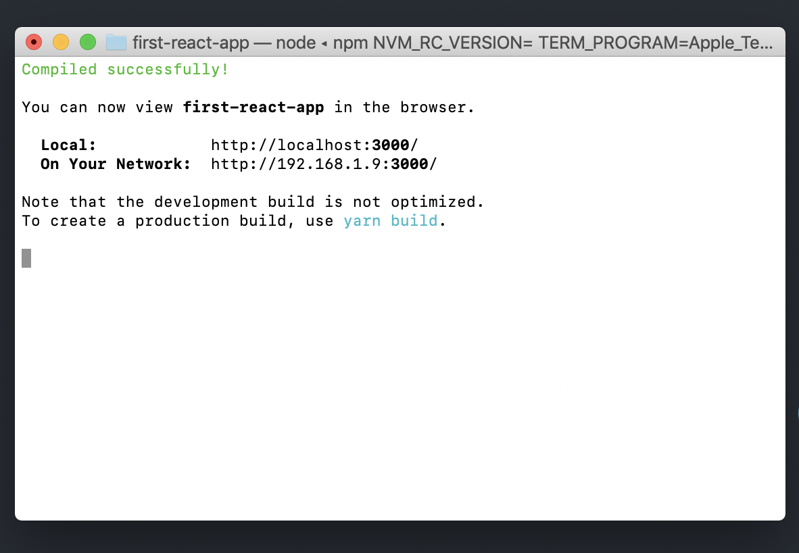
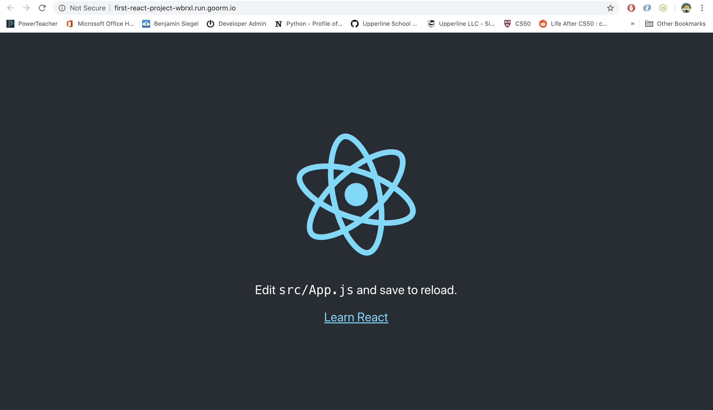
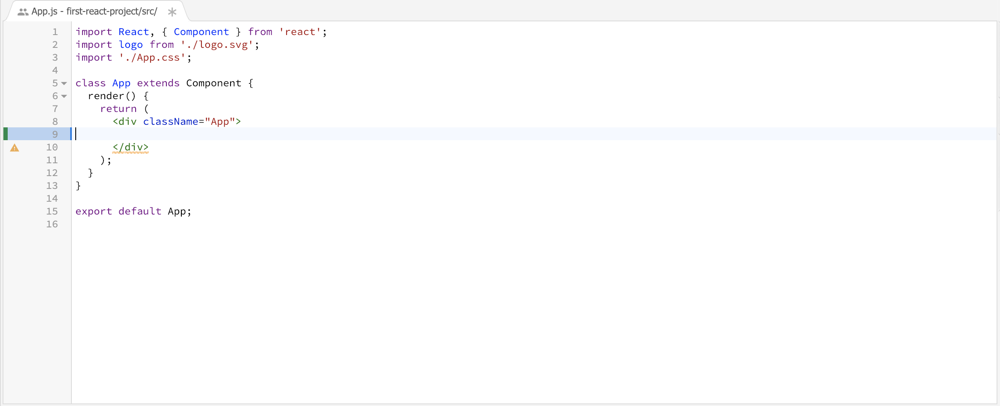
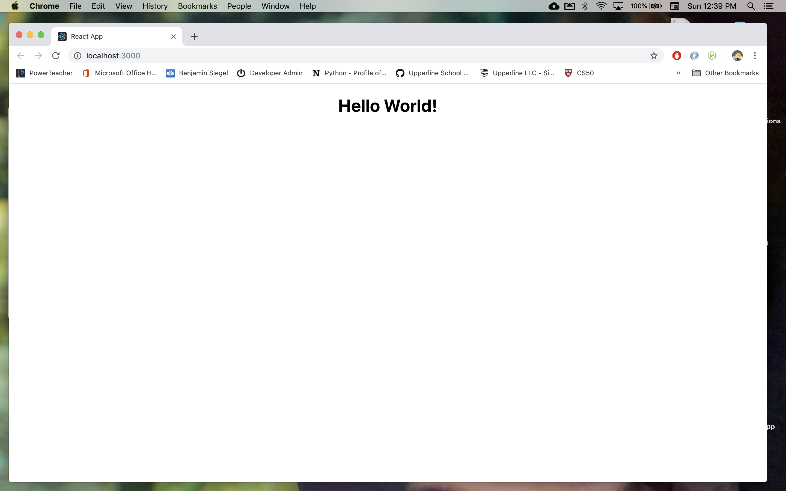

# React Setup

## Learning Objectives

* SWBAT set up a React project locally on personal computer or Goorm IDE
* SWBAT edit the React starter page to display HTML they have written
* SWBAT identify why React is a popular front-end development framework

## Sequence

1. [Launch](#launch)
2. [React in the Wild](#react-in-the-wild)
3. [React Setup: Local](#local)
4. [React Setup: Goorm](goorm-react-setup.md)
5. [Close](#close)

## Launch

> Note to Teachers: You can either (1) print out the two worksheets below or (2) direct students to the digital versions. We've found it's easier for students to have the print-outs to be able to compare HTML and React side-by-side.

Take a look at these two versions of the same website, one built using HTML and one built using React:

1. [HTML site](launch-worksheet-html.md)
2. [React site](launch-worksheet-react.md)

* What do you notice about the two sites?
* What is similar between the two?
* What is different between the two?

You may have noticed that the HTML site is made up of 3 files, whereas the React site has 4. And the code for the React site might look strange to you, but see if you can piece together how the files in the React version of the site are working together.

Now let's say you have to go in and make a change to the navigation bar on this website.

* Where in the HTML version is the navigation bar?
* Where in the React version is the navigation bar?

If you wanted to add a new item to the navigation bar:

* In how many places would you have to edit the HTML site?
* In how many places would you have to edit the React site?

Considering that many modern websites might be made up of hundreds of pages, can you start to see why React might be more useful than coding a website just using HTML?

## React in the Wild

React is one the most popular frameworks used today for front-end development. React was developed by Facebook to simplify the process of building a large, complex web-application.

Before we get started learning how to build our own React application, let's try and find some other website that are built with React. There are lots of lists online just like this [list of sites built with React](https://www.quora.com/Which-are-the-top-10-sites-built-with-ReactJS). Consult this list or another one like it, and see which of the sites using React.js you've used before.

Pick your favorite site you can find using React.js, visit that site, and write down your answers to these questions about the site:

1. How long did it take this site to load?
2. Facebook repeats lots of high-level elements like posts, ads, notifications, etc. Are there any repeated or similar elements on the React.js site you picked?
3. Can you click on parts of the site that change the content of the page *without* changing which page you're on?


#### Questions for Students

* What website did you focus on?
* How quickly did your site load?
* Where there repeated or similar elements on your site?
* Did you find click interactions that didn't load new pages?

## React Setup

Now that we have seen some of the features of React in action, it's time to setup our first React project!

### Stay Calm

When you first set up a React project you will see tons of files installed in your file tree. Don't worry! Most of these files you will never need to look at. They are created automatically, and are there to translate the code you write to code the browser can read. If we focus on the basics, React can actually be very easy to use, even when you're first getting started.

<a id="local"></a>
## Local Setup

#### Step 1

First you need to check if you have Node installed on your computer. You can check by typing the following into your terminal.

```HTML
npm -v
```

You should have Node 5.2 or higher installed. If it tells you Node is not installed please go to https://nodejs.org and installed the latest version.

#### Step 2

Once Node is installed, run each of the following lines of code in your terminal:

```HTML
npx create-react-app first-react-app
cd first-react-app
```

The first command tells node where to find the files on the internet to create a new React project and install those files on your computer. You will see we also typed in "first-react-app". This will be the name of the project we create as well as the directory where the files are installed. You can name this project anything as long as there are no spaces or special characters. We could have named it "cat-lovers-website" or "best_dressed_robots".

#### Step 3

Type the following line of code into your terminal:

```HTML
npm start
```

This command tells Node to begin running the React program we have created. You should see the following message in your terminal:



As instructed, let's view our app using the link provided. Open your browser and visit http://localhost:3000/ (or whatever address is provided in your terminal) to see what our React application looks like.

#### Step 4

You should see a page that looks like this. Pretty cool, right? Also - notice how it tells us to edit src/App.js - let's try it out and see what happens.


#### Step 5

Open directory that contains your React project in your code editor. Find the App.js file in the "src" directory. Delete the code inside of the div with the class name "App."



Try adding some HTML to get "Hello World" to appear on the web page instead!



#### Mini-Challenges

* Add an `<h1>` tag with the text "About YOUR_NAME" within the `div` with the class `"App"`. Obviously, replace YOUR_NAME with your actual name.
* Create a short About Me page. This page should include your favorite quote, your nick name, and a list of activities you enjoy.
* Extension - style the page using the `index.css` file

## Close

Pose the questions below for a quick discussion. As always, collect student feedback at the end of the lesson.

##### Question

* Do you think that every time a user signs up for Facebook, an engineer at Facebook must program a new user page? If not, what do you think happens?
